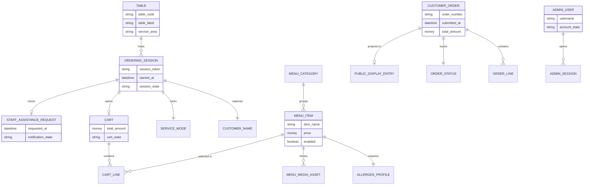

# logical_entities

## bounded_contexts

| context_id | context_name | context_description |
|---|---|---|
| ctx-001 | Session Access | Handles table identification, anonymous customer session start, customer-name capture, and service-mode selection. |
| ctx-002 | Menu Catalog | Owns the customer-visible menu, item categorisation, allergen disclosure, photos, and publishability rules. |
| ctx-003 | Self-Service Ordering | Manages cart building, checkout validation, payment choice, and payment-attempt orchestration. |
| ctx-004 | Assisted Service Coordination | Coordinates the alternate staff-assisted flow, including readiness signalling and staff notification. |
| ctx-005 | Order Fulfilment & Status | Owns confirmed orders, preparation state, public-display visibility, and pickup signalling. |
| ctx-006 | Administration & Access Control | Owns administrator credentials, authenticated admin sessions, and protected menu/order operations. |

## entities

| entity_id | entity_name | entity_type | bounded_context_id | entity_description | key_attributes | related_requirement_ids |
|---|---|---|---|---|---|---|
| [ent-001](05_logical_entities.md#ent-001) | Table | Aggregate Root | ctx-001 | Represents a physical venue table addressable from a dedicated QR code and used to route all subsequent interactions. | table_code: string, table_label: string, service_area: string, qr_status: enum | [BR-001](01_business_requirements.md#br-001), [BR-003](01_business_requirements.md#br-003), [FR-001](02_functional_requirements.md#fr-001), [FR-004](02_functional_requirements.md#fr-004), [UC-001](04_use_cases.md#uc-001), [FEAT-001](03_features.md#feat-001) |
| [ent-002](05_logical_entities.md#ent-002) | Ordering Session | Aggregate Root | ctx-001 | Anonymous browser session linked to a table for the duration of a single customer interaction. | session_token: string, started_at: datetime, session_state: enum, table_ref: [ent-001](05_logical_entities.md#ent-001) | [FR-001](02_functional_requirements.md#fr-001), [FR-002](02_functional_requirements.md#fr-002), [FR-003](02_functional_requirements.md#fr-003), [FR-004](02_functional_requirements.md#fr-004), [UC-001](04_use_cases.md#uc-001), [NFR-007](04c_non_functional_requirements.md#nfr-007) |
| [ent-003](05_logical_entities.md#ent-003) | Customer Name | Value Object | ctx-001 | Short-lived personal identifier captured only to support order handoff and service coordination. | display_name: string, captured_at: datetime, retention_limit: datetime | [FR-002](02_functional_requirements.md#fr-002), [UC-001](04_use_cases.md#uc-001), [NFR-007](04c_non_functional_requirements.md#nfr-007) |
| [ent-004](05_logical_entities.md#ent-004) | Service Mode | Value Object | ctx-001 | Immutable selection that locks the session into self-service or staff-assisted behaviour. | mode: enum(self_service|staff_assisted), selected_at: datetime, locked: boolean | [FR-003](02_functional_requirements.md#fr-003), [UC-001](04_use_cases.md#uc-001), [UC-004](04_use_cases.md#uc-004) |
| [ent-005](05_logical_entities.md#ent-005) | Menu Category | Domain Entity | ctx-002 | Customer-facing grouping for food and drink items used to structure browsing. | category_name: string, display_order: integer, visibility_state: enum | [FR-005](02_functional_requirements.md#fr-005), [FEAT-002](03_features.md#feat-002), [FEAT-007](03_features.md#feat-007) |
| [ent-006](05_logical_entities.md#ent-006) | Menu Item | Aggregate Root | ctx-002 | Sellable food or drink offering exposed to customers only when complete and enabled. | item_name: string, description: text, price: money, enabled: boolean, publishable: boolean | [FR-005](02_functional_requirements.md#fr-005), [FR-006](02_functional_requirements.md#fr-006), [FR-024](02_functional_requirements.md#fr-024), [FR-025](02_functional_requirements.md#fr-025), [FR-026](02_functional_requirements.md#fr-026), [FR-027](02_functional_requirements.md#fr-027), [FEAT-002](03_features.md#feat-002), [FEAT-007](03_features.md#feat-007) |
| [ent-007](05_logical_entities.md#ent-007) | Allergen Profile | Value Object | ctx-002 | Mandatory allergen disclosure attached to each menu item and prominently rendered to customers. | allergen_list: string[], emphasis_label: string, verified_at: datetime | [FR-006](02_functional_requirements.md#fr-006), [FR-024](02_functional_requirements.md#fr-024), [FR-025](02_functional_requirements.md#fr-025), [NFR-009](04c_non_functional_requirements.md#nfr-009) |
| [ent-008](05_logical_entities.md#ent-008) | Menu Media Asset | Value Object | ctx-002 | At least one image associated with a menu item for customer recognition and selection support. | asset_reference: string, alt_text: string, display_order: integer | [FR-006](02_functional_requirements.md#fr-006), [FR-024](02_functional_requirements.md#fr-024), [FR-025](02_functional_requirements.md#fr-025) |
| [ent-009](05_logical_entities.md#ent-009) | Cart | Aggregate Root | ctx-003 | Mutable pre-submission selection owned by a self-service session. | cart_state: enum, total_amount: money, last_updated_at: datetime, session_ref: [ent-002](05_logical_entities.md#ent-002) | [FR-007](02_functional_requirements.md#fr-007), [FR-008](02_functional_requirements.md#fr-008), [FR-009](02_functional_requirements.md#fr-009), [FR-010](02_functional_requirements.md#fr-010), [FR-014](02_functional_requirements.md#fr-014), [UC-002](04_use_cases.md#uc-002), [UC-003](04_use_cases.md#uc-003), [FEAT-003](03_features.md#feat-003) |
| [ent-010](05_logical_entities.md#ent-010) | Cart Line | Domain Entity | ctx-003 | Individual item selection within a cart, including quantity and pricing snapshot before confirmation. | quantity: integer, unit_price_snapshot: money, line_total: money, menu_item_ref: [ent-006](05_logical_entities.md#ent-006) | [FR-007](02_functional_requirements.md#fr-007), [FR-008](02_functional_requirements.md#fr-008), [FR-009](02_functional_requirements.md#fr-009), [UC-002](04_use_cases.md#uc-002), [FEAT-003](03_features.md#feat-003) |
| [ent-011](05_logical_entities.md#ent-011) | Payment Method | Value Object | ctx-003 | Required choice describing how the customer intends to settle a self-service order. | method_type: enum(card|cash), requires_gateway: boolean, confirmed_at: datetime | [FR-011](02_functional_requirements.md#fr-011), [UC-003](04_use_cases.md#uc-003), [FEAT-004](03_features.md#feat-004) |
| [ent-012](05_logical_entities.md#ent-012) | Payment Attempt | Domain Entity | ctx-003 | Trace of a checkout payment processing attempt, especially needed for card authorisation outcomes. | provider: string, outcome: enum, processed_at: datetime, failure_reason: string? | [FR-011](02_functional_requirements.md#fr-011), [FR-012](02_functional_requirements.md#fr-012), [SCN-006](04b_scenarios.md#scn-006), [SCN-007](04b_scenarios.md#scn-007), [SCN-009](04b_scenarios.md#scn-009), [NFR-005](04c_non_functional_requirements.md#nfr-005) |
| [ent-013](05_logical_entities.md#ent-013) | Customer Order | Aggregate Root | ctx-005 | Confirmed self-service order with a unique customer-visible number and durable lifecycle. | order_number: string, submitted_at: datetime, total_amount: money, table_ref: [ent-001](05_logical_entities.md#ent-001), payment_method: [ent-011](05_logical_entities.md#ent-011) | [FR-010](02_functional_requirements.md#fr-010), [FR-011](02_functional_requirements.md#fr-011), [FR-012](02_functional_requirements.md#fr-012), [FR-013](02_functional_requirements.md#fr-013), [FR-019](02_functional_requirements.md#fr-019), [FR-020](02_functional_requirements.md#fr-020), [UC-003](04_use_cases.md#uc-003), [UC-005](04_use_cases.md#uc-005), [NFR-001](04c_non_functional_requirements.md#nfr-001), [NFR-004](04c_non_functional_requirements.md#nfr-004) |
| [ent-014](05_logical_entities.md#ent-014) | Order Line | Domain Entity | ctx-005 | Confirmed line item inside a submitted order, preserving item, quantity, and price snapshots. | quantity: integer, item_name_snapshot: string, unit_price_snapshot: money, line_total: money | [FR-012](02_functional_requirements.md#fr-012), [UC-003](04_use_cases.md#uc-003), [NFR-004](04c_non_functional_requirements.md#nfr-004) |
| [ent-015](05_logical_entities.md#ent-015) | Order Status | Value Object | ctx-005 | State descriptor used for preparation, readiness, pickup removal, and display logic. | preparation_state: enum, ready_at: datetime?, removal_deadline: datetime? | [FR-020](02_functional_requirements.md#fr-020), [FR-021](02_functional_requirements.md#fr-021), [FR-022](02_functional_requirements.md#fr-022), [UC-005](04_use_cases.md#uc-005), [UC-006](04_use_cases.md#uc-006) |
| [ent-016](05_logical_entities.md#ent-016) | Staff Assistance Request | Aggregate Root | ctx-004 | One-time readiness signal generated when a customer in staff-assisted mode asks to be approached. | requested_at: datetime, notification_state: enum, closed_at: datetime?, session_ref: [ent-002](05_logical_entities.md#ent-002) | [FR-015](02_functional_requirements.md#fr-015), [FR-016](02_functional_requirements.md#fr-016), [FR-017](02_functional_requirements.md#fr-017), [FR-018](02_functional_requirements.md#fr-018), [UC-004](04_use_cases.md#uc-004), [FEAT-005](03_features.md#feat-005) |
| [ent-017](05_logical_entities.md#ent-017) | Staff Assistance Requested | Domain Event | ctx-004 | Domain event emitted when a readiness signal is committed and staff must be notified with the table reference. | table_ref: [ent-001](05_logical_entities.md#ent-001), triggered_at: datetime, delivery_status: enum | [FR-016](02_functional_requirements.md#fr-016), [FR-017](02_functional_requirements.md#fr-017), [UC-004](04_use_cases.md#uc-004), [FEAT-005](03_features.md#feat-005) |
| [ent-018](05_logical_entities.md#ent-018) | Order Submitted | Domain Event | ctx-005 | Domain event emitted after a self-service order has been durably recorded and assigned an order number. | order_ref: [ent-013](05_logical_entities.md#ent-013), triggered_at: datetime, payment_method: [ent-011](05_logical_entities.md#ent-011) | [FR-012](02_functional_requirements.md#fr-012), [FR-013](02_functional_requirements.md#fr-013), [UC-003](04_use_cases.md#uc-003) |
| [ent-019](05_logical_entities.md#ent-019) | Order Ready for Pickup | Domain Event | ctx-005 | Domain event emitted when the admin marks an order ready and the public display must change immediately. | order_ref: [ent-013](05_logical_entities.md#ent-013), ready_at: datetime, display_channel: string | [FR-021](02_functional_requirements.md#fr-021), [UC-006](04_use_cases.md#uc-006), [FEAT-006](03_features.md#feat-006) |
| [ent-020](05_logical_entities.md#ent-020) | Card Payment Failed | Domain Event | ctx-003 | Domain event emitted when Stripe rejects or cannot complete card authorisation. | session_ref: [ent-002](05_logical_entities.md#ent-002), occurred_at: datetime, reason_code: string | [SCN-009](04b_scenarios.md#scn-009), [NFR-005](04c_non_functional_requirements.md#nfr-005), [FEAT-004](03_features.md#feat-004) |
| [ent-021](05_logical_entities.md#ent-021) | Admin User | Aggregate Root | ctx-006 | Venue administrator identity allowed to manage the menu and update self-service order readiness. | username: string, password_hash: string, account_state: enum, last_login_at: datetime? | [FR-023](02_functional_requirements.md#fr-023), [FR-024](02_functional_requirements.md#fr-024), [FR-025](02_functional_requirements.md#fr-025), [FR-026](02_functional_requirements.md#fr-026), [FR-027](02_functional_requirements.md#fr-027), [UC-006](04_use_cases.md#uc-006), [UC-007](04_use_cases.md#uc-007), [NFR-006](04c_non_functional_requirements.md#nfr-006) |
| [ent-022](05_logical_entities.md#ent-022) | Admin Session | Domain Entity | ctx-006 | Authenticated admin interaction window subject to inactivity expiry and protected action checks. | session_id: string, authenticated_at: datetime, expires_at: datetime, active: boolean | [FR-023](02_functional_requirements.md#fr-023), [SCN-016](04b_scenarios.md#scn-016), [NFR-006](04c_non_functional_requirements.md#nfr-006) |
| [ent-023](05_logical_entities.md#ent-023) | Public Display Entry | Domain Entity | ctx-005 | Projection row shown on the in-venue public screen for a self-service order currently in preparation or ready. | display_order_number: string, display_state: enum, visible_until: datetime? | [FR-019](02_functional_requirements.md#fr-019), [FR-020](02_functional_requirements.md#fr-020), [FR-021](02_functional_requirements.md#fr-021), [FR-022](02_functional_requirements.md#fr-022), [UC-005](04_use_cases.md#uc-005), [UC-006](04_use_cases.md#uc-006), [FEAT-006](03_features.md#feat-006) |

## entity_relationships

| relationship_id | source_entity_id | target_entity_id | relationship_type | relationship_description |
|---|---|---|---|---|
| rel-001 | [ent-001](05_logical_entities.md#ent-001) | [ent-002](05_logical_entities.md#ent-002) | 1:N | One table can host many ordering sessions over time; each session is linked to exactly one table. |
| rel-002 | [ent-002](05_logical_entities.md#ent-002) | [ent-003](05_logical_entities.md#ent-003) | 1:1 | Each ordering session carries exactly one captured customer name for the active interaction. |
| rel-003 | [ent-002](05_logical_entities.md#ent-002) | [ent-004](05_logical_entities.md#ent-004) | 1:1 | Each ordering session stores one locked service-mode selection. |
| rel-004 | [ent-005](05_logical_entities.md#ent-005) | [ent-006](05_logical_entities.md#ent-006) | 1:N | A menu category contains many menu items. |
| rel-005 | [ent-006](05_logical_entities.md#ent-006) | [ent-007](05_logical_entities.md#ent-007) | 1:1 | Each published menu item requires one allergen profile. |
| rel-006 | [ent-006](05_logical_entities.md#ent-006) | [ent-008](05_logical_entities.md#ent-008) | 1:N | A menu item exposes one or more media assets. |
| rel-007 | [ent-002](05_logical_entities.md#ent-002) | [ent-009](05_logical_entities.md#ent-009) | 1:0..1 | A self-service session may own one active cart. |
| rel-008 | [ent-009](05_logical_entities.md#ent-009) | [ent-010](05_logical_entities.md#ent-010) | 1:N | A cart contains one or more cart lines while items are selected. |
| rel-009 | [ent-010](05_logical_entities.md#ent-010) | [ent-006](05_logical_entities.md#ent-006) | N:1 | Each cart line references one menu item. |
| rel-010 | [ent-009](05_logical_entities.md#ent-009) | [ent-011](05_logical_entities.md#ent-011) | 1:0..1 | A cart acquires one payment-method choice before submission. |
| rel-011 | [ent-013](05_logical_entities.md#ent-013) | [ent-014](05_logical_entities.md#ent-014) | 1:N | A confirmed order contains one or more order lines. |
| rel-012 | [ent-013](05_logical_entities.md#ent-013) | [ent-015](05_logical_entities.md#ent-015) | 1:1 | Each order has one current order-status descriptor. |
| rel-013 | [ent-013](05_logical_entities.md#ent-013) | [ent-023](05_logical_entities.md#ent-023) | 1:0..1 | A self-service order may have one active public-display entry. |
| rel-014 | [ent-013](05_logical_entities.md#ent-013) | [ent-012](05_logical_entities.md#ent-012) | 1:0..N | A confirmed order may retain one or more payment attempts for audit and support. |
| rel-015 | [ent-016](05_logical_entities.md#ent-016) | [ent-002](05_logical_entities.md#ent-002) | N:1 | A staff-assistance request is raised from exactly one ordering session. |
| rel-016 | [ent-016](05_logical_entities.md#ent-016) | [ent-017](05_logical_entities.md#ent-017) | 1:1 | Committing a staff-assistance request emits one readiness event. |
| rel-017 | [ent-013](05_logical_entities.md#ent-013) | [ent-018](05_logical_entities.md#ent-018) | 1:1 | Persisting a self-service order emits one order-submitted event. |
| rel-018 | [ent-013](05_logical_entities.md#ent-013) | [ent-019](05_logical_entities.md#ent-019) | 1:0..N | An order can emit readiness events when it changes to pickup-ready. |
| rel-019 | [ent-012](05_logical_entities.md#ent-012) | [ent-020](05_logical_entities.md#ent-020) | 1:0..1 | A failed card payment attempt emits one payment-failed event. |
| rel-020 | [ent-021](05_logical_entities.md#ent-021) | [ent-022](05_logical_entities.md#ent-022) | 1:N | One administrator can create many authenticated admin sessions over time. |

## entity_relationship_diagram

## entity_anchors

### ent-001

- **Name:** Table
- **Type:** Aggregate Root
- **Bounded context:** ctx-001
- **Summary:** Represents a physical venue table addressable from a dedicated QR code and used to route all subsequent interactions.

### ent-002

- **Name:** Ordering Session
- **Type:** Aggregate Root
- **Bounded context:** ctx-001
- **Summary:** Anonymous browser session linked to a table for the duration of a single customer interaction.

### ent-003

- **Name:** Customer Name
- **Type:** Value Object
- **Bounded context:** ctx-001
- **Summary:** Short-lived personal identifier captured only to support order handoff and service coordination.

### ent-004

- **Name:** Service Mode
- **Type:** Value Object
- **Bounded context:** ctx-001
- **Summary:** Immutable selection that locks the session into self-service or staff-assisted behaviour.

### ent-005

- **Name:** Menu Category
- **Type:** Domain Entity
- **Bounded context:** ctx-002
- **Summary:** Customer-facing grouping for food and drink items used to structure browsing.

### ent-006

- **Name:** Menu Item
- **Type:** Aggregate Root
- **Bounded context:** ctx-002
- **Summary:** Sellable food or drink offering exposed to customers only when complete and enabled.

### ent-007

- **Name:** Allergen Profile
- **Type:** Value Object
- **Bounded context:** ctx-002
- **Summary:** Mandatory allergen disclosure attached to each menu item and prominently rendered to customers.

### ent-008

- **Name:** Menu Media Asset
- **Type:** Value Object
- **Bounded context:** ctx-002
- **Summary:** At least one image associated with a menu item for customer recognition and selection support.

### ent-009

- **Name:** Cart
- **Type:** Aggregate Root
- **Bounded context:** ctx-003
- **Summary:** Mutable pre-submission selection owned by a self-service session.

### ent-010

- **Name:** Cart Line
- **Type:** Domain Entity
- **Bounded context:** ctx-003
- **Summary:** Individual item selection within a cart, including quantity and pricing snapshot before confirmation.

### ent-011

- **Name:** Payment Method
- **Type:** Value Object
- **Bounded context:** ctx-003
- **Summary:** Required choice describing how the customer intends to settle a self-service order.

### ent-012

- **Name:** Payment Attempt
- **Type:** Domain Entity
- **Bounded context:** ctx-003
- **Summary:** Trace of a checkout payment processing attempt, especially needed for card authorisation outcomes.

### ent-013

- **Name:** Customer Order
- **Type:** Aggregate Root
- **Bounded context:** ctx-005
- **Summary:** Confirmed self-service order with a unique customer-visible number and durable lifecycle.

### ent-014

- **Name:** Order Line
- **Type:** Domain Entity
- **Bounded context:** ctx-005
- **Summary:** Confirmed line item inside a submitted order, preserving item, quantity, and price snapshots.

### ent-015

- **Name:** Order Status
- **Type:** Value Object
- **Bounded context:** ctx-005
- **Summary:** State descriptor used for preparation, readiness, pickup removal, and display logic.

### ent-016

- **Name:** Staff Assistance Request
- **Type:** Aggregate Root
- **Bounded context:** ctx-004
- **Summary:** One-time readiness signal generated when a customer in staff-assisted mode asks to be approached.

### ent-017

- **Name:** Staff Assistance Requested
- **Type:** Domain Event
- **Bounded context:** ctx-004
- **Summary:** Domain event emitted when a readiness signal is committed and staff must be notified with the table reference.

### ent-018

- **Name:** Order Submitted
- **Type:** Domain Event
- **Bounded context:** ctx-005
- **Summary:** Domain event emitted after a self-service order has been durably recorded and assigned an order number.

### ent-019

- **Name:** Order Ready for Pickup
- **Type:** Domain Event
- **Bounded context:** ctx-005
- **Summary:** Domain event emitted when the admin marks an order ready and the public display must change immediately.

### ent-020

- **Name:** Card Payment Failed
- **Type:** Domain Event
- **Bounded context:** ctx-003
- **Summary:** Domain event emitted when Stripe rejects or cannot complete card authorisation.

### ent-021

- **Name:** Admin User
- **Type:** Aggregate Root
- **Bounded context:** ctx-006
- **Summary:** Venue administrator identity allowed to manage the menu and update self-service order readiness.

### ent-022

- **Name:** Admin Session
- **Type:** Domain Entity
- **Bounded context:** ctx-006
- **Summary:** Authenticated admin interaction window subject to inactivity expiry and protected action checks.

### ent-023

- **Name:** Public Display Entry
- **Type:** Domain Entity
- **Bounded context:** ctx-005
- **Summary:** Projection row shown on the in-venue public screen for a self-service order currently in preparation or ready.

ENTITIES_COMPLETED
