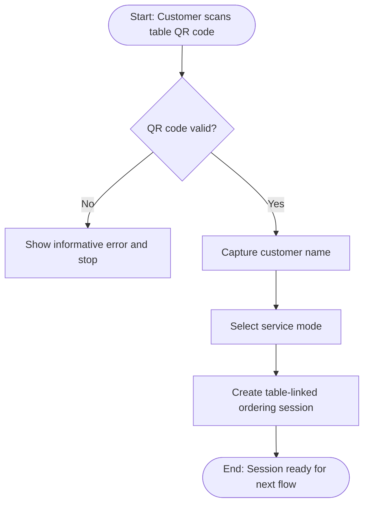
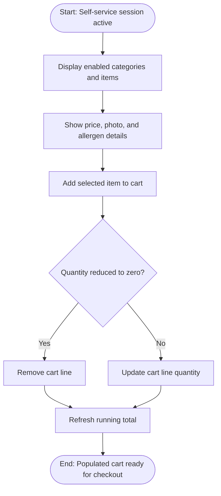
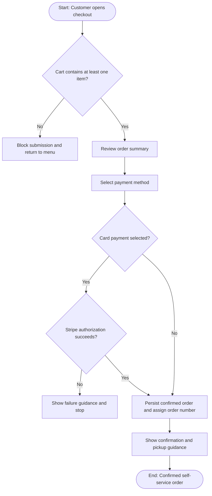
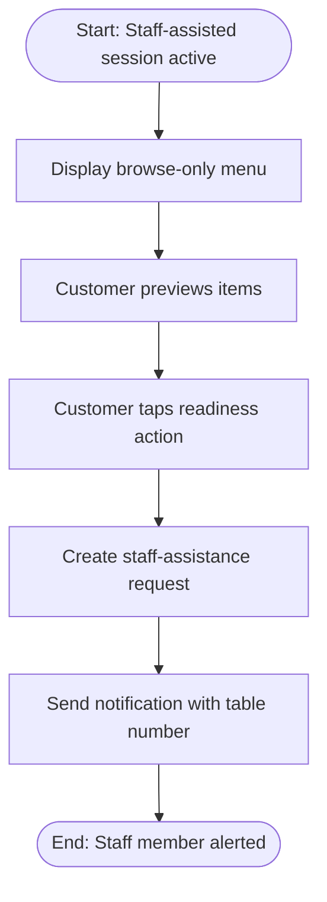
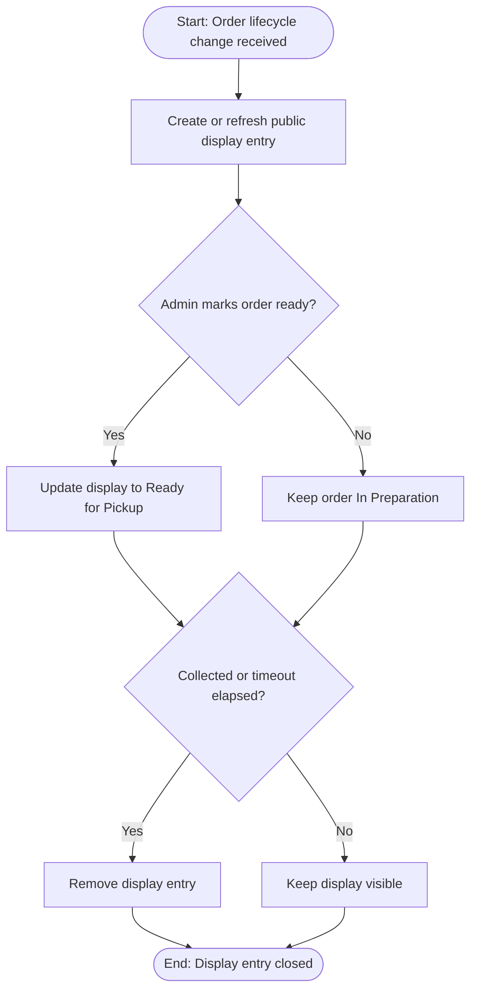
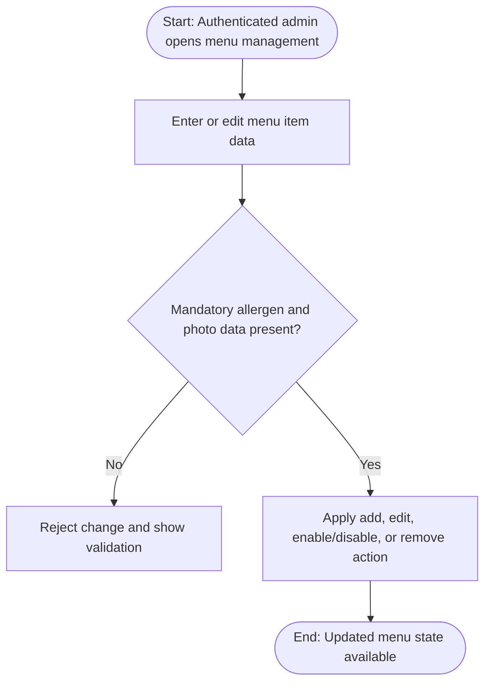
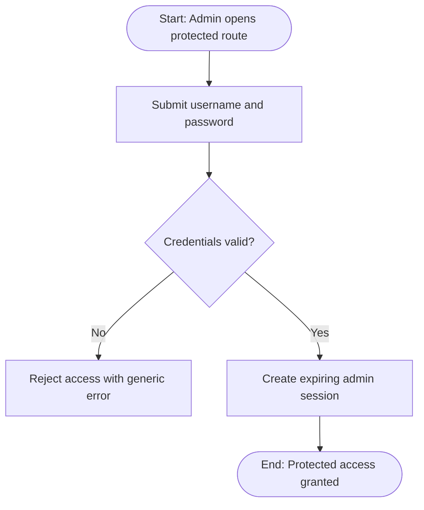

# business_processes

## process_catalog

| process_id | process_name | process_type | process_description | trigger | actors | input_entities | output_entities | related_requirement_ids |
|---|---|---|---|---|---|---|---|---|
| [proc-001](06_processes.md#proc-001) | Customer table session initiation | Core | Starts an anonymous table-scoped interaction by validating the scanned QR code, capturing the customer name, and locking the selected service mode. | Customer scans a table QR code | [role-001](01_business_requirements.md#role-001) | [ent-001](05_logical_entities.md#ent-001) | [ent-002](05_logical_entities.md#ent-002), [ent-003](05_logical_entities.md#ent-003), [ent-004](05_logical_entities.md#ent-004) | [BR-001](01_business_requirements.md#br-001), [BR-003](01_business_requirements.md#br-003), [BR-004](01_business_requirements.md#br-004), [FR-001](02_functional_requirements.md#fr-001), [FR-002](02_functional_requirements.md#fr-002), [FR-003](02_functional_requirements.md#fr-003), [FR-004](02_functional_requirements.md#fr-004), [UC-001](04_use_cases.md#uc-001), [FEAT-001](03_features.md#feat-001) |
| [proc-002](06_processes.md#proc-002) | Menu browsing and cart composition | Core | Lets a customer browse enabled menu items with prominent allergen details, add selections, adjust quantities, and maintain a live running total. | Self-service ordering session is active | [role-001](01_business_requirements.md#role-001) | [ent-002](05_logical_entities.md#ent-002), [ent-005](05_logical_entities.md#ent-005), [ent-006](05_logical_entities.md#ent-006), [ent-007](05_logical_entities.md#ent-007) | [ent-009](05_logical_entities.md#ent-009), [ent-010](05_logical_entities.md#ent-010) | [FR-005](02_functional_requirements.md#fr-005), [FR-006](02_functional_requirements.md#fr-006), [FR-007](02_functional_requirements.md#fr-007), [FR-008](02_functional_requirements.md#fr-008), [FR-009](02_functional_requirements.md#fr-009), [UC-002](04_use_cases.md#uc-002), [FEAT-002](03_features.md#feat-002), [FEAT-003](03_features.md#feat-003) |
| [proc-003](06_processes.md#proc-003) | Self-service checkout and order confirmation | Core | Validates a non-empty cart, captures a mandatory payment choice, coordinates card authorisation when required, and creates the confirmed order. | Customer proceeds to checkout with a non-empty cart | [role-001](01_business_requirements.md#role-001) | [ent-009](05_logical_entities.md#ent-009), [ent-010](05_logical_entities.md#ent-010), [ent-011](05_logical_entities.md#ent-011) | [ent-012](05_logical_entities.md#ent-012), [ent-013](05_logical_entities.md#ent-013), [ent-014](05_logical_entities.md#ent-014), [ent-015](05_logical_entities.md#ent-015), [ent-018](05_logical_entities.md#ent-018), [ent-020](05_logical_entities.md#ent-020) | [FR-010](02_functional_requirements.md#fr-010), [FR-011](02_functional_requirements.md#fr-011), [FR-012](02_functional_requirements.md#fr-012), [FR-013](02_functional_requirements.md#fr-013), [FR-014](02_functional_requirements.md#fr-014), [UC-003](04_use_cases.md#uc-003), [FEAT-004](03_features.md#feat-004), [NFR-001](04c_non_functional_requirements.md#nfr-001), [NFR-004](04c_non_functional_requirements.md#nfr-004), [NFR-005](04c_non_functional_requirements.md#nfr-005) |
| [proc-004](06_processes.md#proc-004) | Staff-assisted service request | Core | Supports the alternate flow where the customer browses the menu in read-only mode and triggers a one-time readiness signal for staff. | Customer in staff-assisted mode taps the readiness action | [role-001](01_business_requirements.md#role-001), [role-003](01_business_requirements.md#role-003) | [ent-002](05_logical_entities.md#ent-002), [ent-004](05_logical_entities.md#ent-004), [ent-006](05_logical_entities.md#ent-006) | [ent-016](05_logical_entities.md#ent-016), [ent-017](05_logical_entities.md#ent-017) | [FR-015](02_functional_requirements.md#fr-015), [FR-016](02_functional_requirements.md#fr-016), [FR-017](02_functional_requirements.md#fr-017), [FR-018](02_functional_requirements.md#fr-018), [UC-004](04_use_cases.md#uc-004), [FEAT-005](03_features.md#feat-005) |
| [proc-005](06_processes.md#proc-005) | Order status publication and pickup signalling | Supporting | Projects confirmed self-service orders to the public display, updates readiness immediately, and removes stale entries after collection or timeout. | A self-service order is confirmed or its readiness state changes | [role-001](01_business_requirements.md#role-001), [role-002](01_business_requirements.md#role-002) | [ent-013](05_logical_entities.md#ent-013), [ent-015](05_logical_entities.md#ent-015) | [ent-019](05_logical_entities.md#ent-019), [ent-023](05_logical_entities.md#ent-023) | [FR-019](02_functional_requirements.md#fr-019), [FR-020](02_functional_requirements.md#fr-020), [FR-021](02_functional_requirements.md#fr-021), [FR-022](02_functional_requirements.md#fr-022), [UC-005](04_use_cases.md#uc-005), [UC-006](04_use_cases.md#uc-006), [FEAT-006](03_features.md#feat-006) |
| [proc-006](06_processes.md#proc-006) | Menu catalog administration | Management | Allows the administrator to add, edit, enable, disable, and permanently remove menu items while preserving mandatory allergen and photo completeness. | Authenticated admin opens menu management | [role-002](01_business_requirements.md#role-002) | [ent-021](05_logical_entities.md#ent-021), [ent-006](05_logical_entities.md#ent-006), [ent-007](05_logical_entities.md#ent-007), [ent-008](05_logical_entities.md#ent-008) | [ent-006](05_logical_entities.md#ent-006), [ent-007](05_logical_entities.md#ent-007), [ent-008](05_logical_entities.md#ent-008) | [FR-024](02_functional_requirements.md#fr-024), [FR-025](02_functional_requirements.md#fr-025), [FR-026](02_functional_requirements.md#fr-026), [FR-027](02_functional_requirements.md#fr-027), [UC-007](04_use_cases.md#uc-007), [FEAT-007](03_features.md#feat-007) |
| [proc-007](06_processes.md#proc-007) | Admin authentication and protected access | Supporting | Authenticates the administrator with username and password, creates an expiring admin session, and rejects invalid access attempts. | Admin accesses a protected backoffice route | [role-002](01_business_requirements.md#role-002) | [ent-021](05_logical_entities.md#ent-021) | [ent-022](05_logical_entities.md#ent-022) | [FR-023](02_functional_requirements.md#fr-023), [UC-006](04_use_cases.md#uc-006), [UC-007](04_use_cases.md#uc-007), [NFR-006](04c_non_functional_requirements.md#nfr-006) |

## process_steps

| process_id | step_id | step_order | step_name | step_description | step_type | actor | decision_condition |
|---|---|---|---|---|---|---|---|
| [proc-001](06_processes.md#proc-001) | step-001 | 1 | Scan table QR code | Customer scans the QR code attached to a venue table. | Start | [role-001](01_business_requirements.md#role-001) |  |
| [proc-001](06_processes.md#proc-001) | step-002 | 2 | Validate QR code | System checks whether the QR code resolves to a known table. | Decision | [role-001](01_business_requirements.md#role-001) | If the QR code is invalid or unknown, stop the flow and show an error. |
| [proc-001](06_processes.md#proc-001) | step-003 | 3 | Capture customer name | Customer enters their name and confirms it. | Action | [role-001](01_business_requirements.md#role-001) |  |
| [proc-001](06_processes.md#proc-001) | step-004 | 4 | Select service mode | Customer chooses self-service or staff-assisted mode. | Action | [role-001](01_business_requirements.md#role-001) |  |
| [proc-001](06_processes.md#proc-001) | step-005 | 5 | Create active ordering session | System creates the table-linked session and stores the chosen mode. | Action | [role-001](01_business_requirements.md#role-001) |  |
| [proc-001](06_processes.md#proc-001) | step-006 | 6 | Session ready | Customer proceeds to the next flow determined by the selected mode. | End | [role-001](01_business_requirements.md#role-001) |  |
| [proc-002](06_processes.md#proc-002) | step-007 | 1 | Open self-service menu | Customer opens the enabled menu catalog for the active session. | Start | [role-001](01_business_requirements.md#role-001) |  |
| [proc-002](06_processes.md#proc-002) | step-008 | 2 | Review menu item details | Customer inspects categories, prices, allergen information, and photos. | Action | [role-001](01_business_requirements.md#role-001) |  |
| [proc-002](06_processes.md#proc-002) | step-009 | 3 | Add item to cart | Customer adds a selected item to the cart. | Action | [role-001](01_business_requirements.md#role-001) |  |
| [proc-002](06_processes.md#proc-002) | step-010 | 4 | Adjust quantities | Customer increases or decreases quantities for selected lines. | Decision | [role-001](01_business_requirements.md#role-001) | If quantity becomes zero, remove the cart line. |
| [proc-002](06_processes.md#proc-002) | step-011 | 5 | Refresh running total | System recalculates the running total and keeps it visible. | Action | [role-001](01_business_requirements.md#role-001) |  |
| [proc-002](06_processes.md#proc-002) | step-012 | 6 | Cart ready for checkout | Customer retains a populated cart for checkout. | End | [role-001](01_business_requirements.md#role-001) |  |
| [proc-003](06_processes.md#proc-003) | step-013 | 1 | Open checkout review | Customer enters the review step from a populated cart. | Start | [role-001](01_business_requirements.md#role-001) |  |
| [proc-003](06_processes.md#proc-003) | step-014 | 2 | Validate cart is not empty | System checks that at least one line is still present. | Decision | [role-001](01_business_requirements.md#role-001) | If the cart is empty, block submission and return the customer to the menu. |
| [proc-003](06_processes.md#proc-003) | step-015 | 3 | Confirm order contents | Customer confirms the reviewed item list and total. | Action | [role-001](01_business_requirements.md#role-001) |  |
| [proc-003](06_processes.md#proc-003) | step-016 | 4 | Select payment method | Customer chooses card or cash. | Action | [role-001](01_business_requirements.md#role-001) |  |
| [proc-003](06_processes.md#proc-003) | step-017 | 5 | Process payment path | System either invokes Stripe for card payment or skips the gateway for cash. | Decision | [role-001](01_business_requirements.md#role-001) | If card payment fails, show retry-or-cash guidance and do not create a confirmed order. |
| [proc-003](06_processes.md#proc-003) | step-018 | 6 | Persist confirmed order | System assigns an order number, creates the order, and records the initial status. | Action | [role-001](01_business_requirements.md#role-001) |  |
| [proc-003](06_processes.md#proc-003) | step-019 | 7 | Show confirmation | Customer sees the order number and pickup instructions. | End | [role-001](01_business_requirements.md#role-001) |  |
| [proc-004](06_processes.md#proc-004) | step-020 | 1 | Open browse-only menu | Customer in staff-assisted mode views the menu without cart actions. | Start | [role-001](01_business_requirements.md#role-001) |  |
| [proc-004](06_processes.md#proc-004) | step-021 | 2 | Preview items | Customer browses items in advance before speaking to staff. | Action | [role-001](01_business_requirements.md#role-001) |  |
| [proc-004](06_processes.md#proc-004) | step-022 | 3 | Signal readiness | Customer triggers the one-time readiness action. | Action | [role-001](01_business_requirements.md#role-001) |  |
| [proc-004](06_processes.md#proc-004) | step-023 | 4 | Create assistance request | System records the staff-assistance request for the table. | Action | [role-001](01_business_requirements.md#role-001) |  |
| [proc-004](06_processes.md#proc-004) | step-024 | 5 | Notify staff member | System delivers the table-number notification to staff. | End | [role-003](01_business_requirements.md#role-003) |  |
| [proc-005](06_processes.md#proc-005) | step-025 | 1 | Receive order lifecycle change | A confirmed order or readiness change reaches the status flow. | Start | [role-002](01_business_requirements.md#role-002) |  |
| [proc-005](06_processes.md#proc-005) | step-026 | 2 | Project display entry | System creates or refreshes the public display entry for the order. | Action | [role-002](01_business_requirements.md#role-002) |  |
| [proc-005](06_processes.md#proc-005) | step-027 | 3 | Mark order ready | Admin marks the order as ready for pickup. | Action | [role-002](01_business_requirements.md#role-002) |  |
| [proc-005](06_processes.md#proc-005) | step-028 | 4 | Publish updated status | System updates the display immediately for customers. | Action | [role-002](01_business_requirements.md#role-002) |  |
| [proc-005](06_processes.md#proc-005) | step-029 | 5 | Remove stale display entry | System or admin removes the entry after collection or timeout. | End | [role-002](01_business_requirements.md#role-002) |  |
| [proc-006](06_processes.md#proc-006) | step-030 | 1 | Open menu management | Authenticated admin enters the menu maintenance area. | Start | [role-002](01_business_requirements.md#role-002) |  |
| [proc-006](06_processes.md#proc-006) | step-031 | 2 | Capture menu item data | Admin enters or edits item name, description, price, category, allergens, and photo. | Action | [role-002](01_business_requirements.md#role-002) |  |
| [proc-006](06_processes.md#proc-006) | step-032 | 3 | Validate completeness | System checks that mandatory allergen and photo data are present. | Decision | [role-002](01_business_requirements.md#role-002) | If mandatory fields are missing, reject the change. |
| [proc-006](06_processes.md#proc-006) | step-033 | 4 | Apply catalog change | System adds, updates, enables, disables, or removes the item. | Action | [role-002](01_business_requirements.md#role-002) |  |
| [proc-006](06_processes.md#proc-006) | step-034 | 5 | Expose updated menu state | The next customer session sees the revised menu state. | End | [role-002](01_business_requirements.md#role-002) |  |
| [proc-007](06_processes.md#proc-007) | step-035 | 1 | Open protected route | Admin attempts to access the protected backoffice entry point. | Start | [role-002](01_business_requirements.md#role-002) |  |
| [proc-007](06_processes.md#proc-007) | step-036 | 2 | Submit credentials | Admin provides username and password. | Action | [role-002](01_business_requirements.md#role-002) |  |
| [proc-007](06_processes.md#proc-007) | step-037 | 3 | Validate credentials | System verifies the credentials. | Decision | [role-002](01_business_requirements.md#role-002) | If credentials are invalid, deny access and show a generic error. |
| [proc-007](06_processes.md#proc-007) | step-038 | 4 | Create admin session | System establishes an authenticated admin session with expiry. | Action | [role-002](01_business_requirements.md#role-002) |  |
| [proc-007](06_processes.md#proc-007) | step-039 | 5 | Grant protected access | Admin gains access to protected menu and order operations. | End | [role-002](01_business_requirements.md#role-002) |  |

## process_flow_diagrams

### proc-001: Customer table session initiation

### proc-002: Menu browsing and cart composition

### proc-003: Self-service checkout and order confirmation

### proc-004: Staff-assisted service request

### proc-005: Order status publication and pickup signalling

### proc-006: Menu catalog administration

### proc-007: Admin authentication and protected access

## process_anchors

### proc-001

- **Name:** Customer table session initiation
- **Type:** Core
- **Summary:** Starts an anonymous table-scoped interaction by validating the scanned QR code, capturing the customer name, and locking the selected service mode.

### proc-002

- **Name:** Menu browsing and cart composition
- **Type:** Core
- **Summary:** Lets a customer browse enabled menu items with prominent allergen details, add selections, adjust quantities, and maintain a live running total.

### proc-003

- **Name:** Self-service checkout and order confirmation
- **Type:** Core
- **Summary:** Validates a non-empty cart, captures a mandatory payment choice, coordinates card authorisation when required, and creates the confirmed order.

### proc-004

- **Name:** Staff-assisted service request
- **Type:** Core
- **Summary:** Supports the alternate flow where the customer browses the menu in read-only mode and triggers a one-time readiness signal for staff.

### proc-005

- **Name:** Order status publication and pickup signalling
- **Type:** Supporting
- **Summary:** Projects confirmed self-service orders to the public display, updates readiness immediately, and removes stale entries after collection or timeout.

### proc-006

- **Name:** Menu catalog administration
- **Type:** Management
- **Summary:** Allows the administrator to add, edit, enable, disable, and permanently remove menu items while preserving mandatory allergen and photo completeness.

### proc-007

- **Name:** Admin authentication and protected access
- **Type:** Supporting
- **Summary:** Authenticates the administrator with username and password, creates an expiring admin session, and rejects invalid access attempts.

PROCESSES_COMPLETED
