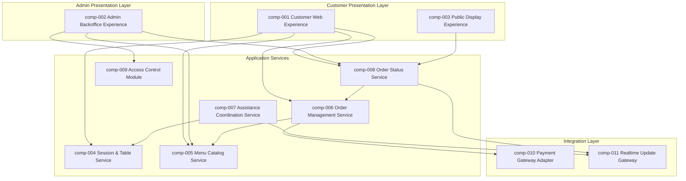

# logical_components

## component_catalog

| component_id | component_name | component_type | component_description | responsibility | owned_entities | supported_processes | related_feature_ids |
|---|---|---|---|---|---|---|---|
| [comp-001](07_components.md#comp-001) | Customer Web Experience | Layer | Browser-facing experience for customers from QR session start through checkout or staff-request completion. | Render the customer journey with minimal friction on mobile browsers, including prominent allergen visibility and live cart feedback. | [ent-002](05_logical_entities.md#ent-002), [ent-009](05_logical_entities.md#ent-009), [ent-013](05_logical_entities.md#ent-013) | [proc-001](06_processes.md#proc-001), [proc-002](06_processes.md#proc-002), [proc-003](06_processes.md#proc-003), [proc-004](06_processes.md#proc-004), [proc-005](06_processes.md#proc-005) | [FEAT-001](03_features.md#feat-001), [FEAT-002](03_features.md#feat-002), [FEAT-003](03_features.md#feat-003), [FEAT-004](03_features.md#feat-004), [FEAT-005](03_features.md#feat-005), [FEAT-006](03_features.md#feat-006) |
| [comp-002](07_components.md#comp-002) | Admin Backoffice Experience | Layer | Protected browser experience for menu maintenance and order readiness actions. | Provide administrators with secure menu and order-management screens without exposing implementation details. | [ent-021](05_logical_entities.md#ent-021), [ent-022](05_logical_entities.md#ent-022), [ent-006](05_logical_entities.md#ent-006), [ent-013](05_logical_entities.md#ent-013) | [proc-005](06_processes.md#proc-005), [proc-006](06_processes.md#proc-006), [proc-007](06_processes.md#proc-007) | [FEAT-006](03_features.md#feat-006), [FEAT-007](03_features.md#feat-007) |
| [comp-003](07_components.md#comp-003) | Public Display Experience | Layer | Unauthenticated in-venue screen that passively shows self-service order progress. | Present order numbers and readiness states clearly to waiting customers. | [ent-023](05_logical_entities.md#ent-023), [ent-015](05_logical_entities.md#ent-015) | [proc-005](06_processes.md#proc-005) | [FEAT-006](03_features.md#feat-006) |
| [comp-004](07_components.md#comp-004) | Session & Table Service | Service | Owns table lookup, QR-entry validation, customer-name capture, and mode selection. | Establish and maintain the anonymous ordering context tied to a physical table. | [ent-001](05_logical_entities.md#ent-001), [ent-002](05_logical_entities.md#ent-002), [ent-003](05_logical_entities.md#ent-003), [ent-004](05_logical_entities.md#ent-004) | [proc-001](06_processes.md#proc-001), [proc-004](06_processes.md#proc-004) | [FEAT-001](03_features.md#feat-001), [FEAT-005](03_features.md#feat-005) |
| [comp-005](07_components.md#comp-005) | Menu Catalog Service | Service | Owns menu categories, items, allergen profiles, photos, and visibility rules. | Serve customer menu queries and admin catalog changes from a single authoritative menu model. | [ent-005](05_logical_entities.md#ent-005), [ent-006](05_logical_entities.md#ent-006), [ent-007](05_logical_entities.md#ent-007), [ent-008](05_logical_entities.md#ent-008) | [proc-002](06_processes.md#proc-002), [proc-004](06_processes.md#proc-004), [proc-006](06_processes.md#proc-006) | [FEAT-002](03_features.md#feat-002), [FEAT-007](03_features.md#feat-007) |
| [comp-006](07_components.md#comp-006) | Order Management Service | Service | Owns carts, checkout validation, payment-method capture, payment-attempt tracking, and confirmed order creation. | Turn customer selections into durable orders while protecting confirmation integrity. | [ent-009](05_logical_entities.md#ent-009), [ent-010](05_logical_entities.md#ent-010), [ent-011](05_logical_entities.md#ent-011), [ent-012](05_logical_entities.md#ent-012), [ent-013](05_logical_entities.md#ent-013), [ent-014](05_logical_entities.md#ent-014), [ent-018](05_logical_entities.md#ent-018), [ent-020](05_logical_entities.md#ent-020) | [proc-002](06_processes.md#proc-002), [proc-003](06_processes.md#proc-003) | [FEAT-003](03_features.md#feat-003), [FEAT-004](03_features.md#feat-004) |
| [comp-007](07_components.md#comp-007) | Assistance Coordination Service | Service | Owns the alternate service request flow for customers who want staff assistance. | Record readiness signals and orchestrate one-time staff notifications without creating an order. | [ent-016](05_logical_entities.md#ent-016), [ent-017](05_logical_entities.md#ent-017) | [proc-004](06_processes.md#proc-004) | [FEAT-005](03_features.md#feat-005) |
| [comp-008](07_components.md#comp-008) | Order Status Service | Service | Owns preparation state transitions, public-display projections, and pickup-ready signalling. | Project confirmed orders into customer-visible status entries and update them with minimal delay. | [ent-015](05_logical_entities.md#ent-015), [ent-019](05_logical_entities.md#ent-019), [ent-023](05_logical_entities.md#ent-023) | [proc-005](06_processes.md#proc-005) | [FEAT-006](03_features.md#feat-006) |
| [comp-009](07_components.md#comp-009) | Access Control Module | Module | Encapsulates admin authentication, session expiry, and protected-action policy checks. | Enforce username/password access for administrators and bound admin session lifetime. | [ent-021](05_logical_entities.md#ent-021), [ent-022](05_logical_entities.md#ent-022) | [proc-006](06_processes.md#proc-006), [proc-007](06_processes.md#proc-007) | [FEAT-007](03_features.md#feat-007) |
| [comp-010](07_components.md#comp-010) | Payment Gateway Adapter | Gateway | Abstraction over Stripe for card authorisation and failure handling. | Keep raw card data out of the application while standardising the order service’s payment calls. | [ent-011](05_logical_entities.md#ent-011), [ent-012](05_logical_entities.md#ent-012), [ent-020](05_logical_entities.md#ent-020) | [proc-003](06_processes.md#proc-003) | [FEAT-004](03_features.md#feat-004) |
| [comp-011](07_components.md#comp-011) | Realtime Update Gateway | Gateway | Push-oriented delivery channel for staff notifications and order-status refreshes. | Distribute near-real-time updates to browsers and display screens without coupling callers to transport details. | [ent-017](05_logical_entities.md#ent-017), [ent-019](05_logical_entities.md#ent-019), [ent-023](05_logical_entities.md#ent-023) | [proc-004](06_processes.md#proc-004), [proc-005](06_processes.md#proc-005) | [FEAT-005](03_features.md#feat-005), [FEAT-006](03_features.md#feat-006) |

## component_interfaces

| component_id | interface_id | interface_direction | interface_name | interface_description | data_entities |
|---|---|---|---|---|---|
| [comp-001](07_components.md#comp-001) | if-001 | Provided | Customer journey UI | Screens and actions for QR entry, menu browsing, cart editing, checkout, and pickup guidance. | [ent-002](05_logical_entities.md#ent-002), [ent-009](05_logical_entities.md#ent-009), [ent-013](05_logical_entities.md#ent-013) |
| [comp-001](07_components.md#comp-001) | if-002 | Required | Session API | Needs table-session activation and service-mode persistence from [comp-004](07_components.md#comp-004). | [ent-001](05_logical_entities.md#ent-001), [ent-002](05_logical_entities.md#ent-002), [ent-004](05_logical_entities.md#ent-004) |
| [comp-001](07_components.md#comp-001) | if-003 | Required | Menu query API | Needs enabled menu items, categories, photos, and allergens from [comp-005](07_components.md#comp-005). | [ent-005](05_logical_entities.md#ent-005), [ent-006](05_logical_entities.md#ent-006), [ent-007](05_logical_entities.md#ent-007), [ent-008](05_logical_entities.md#ent-008) |
| [comp-001](07_components.md#comp-001) | if-004 | Required | Cart and checkout API | Needs cart mutation, payment selection, and order confirmation from [comp-006](07_components.md#comp-006). | [ent-009](05_logical_entities.md#ent-009), [ent-010](05_logical_entities.md#ent-010), [ent-011](05_logical_entities.md#ent-011), [ent-013](05_logical_entities.md#ent-013) |
| [comp-001](07_components.md#comp-001) | if-005 | Required | Order status feed | Needs current order readiness information from [comp-008](07_components.md#comp-008). | [ent-015](05_logical_entities.md#ent-015), [ent-023](05_logical_entities.md#ent-023) |
| [comp-002](07_components.md#comp-002) | if-006 | Provided | Admin operations UI | Screens for login, menu maintenance, order queue viewing, and readiness updates. | [ent-021](05_logical_entities.md#ent-021), [ent-022](05_logical_entities.md#ent-022), [ent-006](05_logical_entities.md#ent-006), [ent-013](05_logical_entities.md#ent-013) |
| [comp-002](07_components.md#comp-002) | if-007 | Required | Admin authentication API | Needs admin sign-in and session validation from [comp-009](07_components.md#comp-009). | [ent-021](05_logical_entities.md#ent-021), [ent-022](05_logical_entities.md#ent-022) |
| [comp-002](07_components.md#comp-002) | if-008 | Required | Catalog maintenance API | Needs create, update, enable/disable, and delete actions from [comp-005](07_components.md#comp-005). | [ent-006](05_logical_entities.md#ent-006), [ent-007](05_logical_entities.md#ent-007), [ent-008](05_logical_entities.md#ent-008) |
| [comp-002](07_components.md#comp-002) | if-009 | Required | Order readiness API | Needs order status transitions from [comp-008](07_components.md#comp-008). | [ent-013](05_logical_entities.md#ent-013), [ent-015](05_logical_entities.md#ent-015), [ent-023](05_logical_entities.md#ent-023) |
| [comp-003](07_components.md#comp-003) | if-010 | Provided | Public display UI | Passive screen rendering of active self-service order numbers and readiness states. | [ent-023](05_logical_entities.md#ent-023) |
| [comp-003](07_components.md#comp-003) | if-011 | Required | Display projection feed | Needs status projections and removals from [comp-008](07_components.md#comp-008). | [ent-015](05_logical_entities.md#ent-015), [ent-023](05_logical_entities.md#ent-023) |
| [comp-004](07_components.md#comp-004) | if-012 | Provided | Table-session API | Creates and retrieves table-linked anonymous ordering sessions. | [ent-001](05_logical_entities.md#ent-001), [ent-002](05_logical_entities.md#ent-002), [ent-003](05_logical_entities.md#ent-003), [ent-004](05_logical_entities.md#ent-004) |
| [comp-005](07_components.md#comp-005) | if-013 | Provided | Menu read API | Returns enabled customer-visible menu data with allergen prominence. | [ent-005](05_logical_entities.md#ent-005), [ent-006](05_logical_entities.md#ent-006), [ent-007](05_logical_entities.md#ent-007), [ent-008](05_logical_entities.md#ent-008) |
| [comp-005](07_components.md#comp-005) | if-014 | Provided | Menu maintenance API | Applies authenticated admin changes to the menu catalog. | [ent-006](05_logical_entities.md#ent-006), [ent-007](05_logical_entities.md#ent-007), [ent-008](05_logical_entities.md#ent-008) |
| [comp-006](07_components.md#comp-006) | if-015 | Provided | Cart and checkout API | Maintains carts, validates checkout, and submits self-service orders. | [ent-009](05_logical_entities.md#ent-009), [ent-010](05_logical_entities.md#ent-010), [ent-011](05_logical_entities.md#ent-011), [ent-013](05_logical_entities.md#ent-013), [ent-014](05_logical_entities.md#ent-014) |
| [comp-006](07_components.md#comp-006) | if-016 | Required | Payment authorisation API | Needs card authorisation outcomes from [comp-010](07_components.md#comp-010). | [ent-011](05_logical_entities.md#ent-011), [ent-012](05_logical_entities.md#ent-012), [ent-020](05_logical_entities.md#ent-020) |
| [comp-006](07_components.md#comp-006) | if-017 | Required | Menu snapshot API | Needs authoritative menu item data from [comp-005](07_components.md#comp-005) at checkout time. | [ent-006](05_logical_entities.md#ent-006), [ent-007](05_logical_entities.md#ent-007) |
| [comp-007](07_components.md#comp-007) | if-018 | Provided | Staff readiness API | Records a one-time readiness request for a staff-assisted table. | [ent-016](05_logical_entities.md#ent-016), [ent-017](05_logical_entities.md#ent-017) |
| [comp-007](07_components.md#comp-007) | if-019 | Required | Realtime notification API | Needs push delivery from [comp-011](07_components.md#comp-011) for staff notifications. | [ent-017](05_logical_entities.md#ent-017) |
| [comp-008](07_components.md#comp-008) | if-020 | Provided | Order status projection API | Creates and updates public-display entries for self-service orders. | [ent-015](05_logical_entities.md#ent-015), [ent-019](05_logical_entities.md#ent-019), [ent-023](05_logical_entities.md#ent-023) |
| [comp-008](07_components.md#comp-008) | if-021 | Required | Confirmed order feed | Needs confirmed-order information from [comp-006](07_components.md#comp-006). | [ent-013](05_logical_entities.md#ent-013), [ent-018](05_logical_entities.md#ent-018) |
| [comp-008](07_components.md#comp-008) | if-022 | Required | Realtime broadcast API | Needs push transport from [comp-011](07_components.md#comp-011) for display updates. | [ent-019](05_logical_entities.md#ent-019), [ent-023](05_logical_entities.md#ent-023) |
| [comp-009](07_components.md#comp-009) | if-023 | Provided | Admin authentication API | Authenticates admins and validates session expiry. | [ent-021](05_logical_entities.md#ent-021), [ent-022](05_logical_entities.md#ent-022) |
| [comp-010](07_components.md#comp-010) | if-024 | Provided | Stripe payment API | Normalised card-payment requests and outcomes delegated to Stripe. | [ent-011](05_logical_entities.md#ent-011), [ent-012](05_logical_entities.md#ent-012), [ent-020](05_logical_entities.md#ent-020) |
| [comp-011](07_components.md#comp-011) | if-025 | Provided | Realtime delivery channels | Push channels used for staff assistance and order-status updates. | [ent-017](05_logical_entities.md#ent-017), [ent-019](05_logical_entities.md#ent-019), [ent-023](05_logical_entities.md#ent-023) |

## component_diagram

## component_anchors

### comp-001

- **Name:** Customer Web Experience
- **Type:** Layer
- **Summary:** Browser-facing experience for customers from QR session start through checkout or staff-request completion.

### comp-002

- **Name:** Admin Backoffice Experience
- **Type:** Layer
- **Summary:** Protected browser experience for menu maintenance and order readiness actions.

### comp-003

- **Name:** Public Display Experience
- **Type:** Layer
- **Summary:** Unauthenticated in-venue screen that passively shows self-service order progress.

### comp-004

- **Name:** Session & Table Service
- **Type:** Service
- **Summary:** Owns table lookup, QR-entry validation, customer-name capture, and mode selection.

### comp-005

- **Name:** Menu Catalog Service
- **Type:** Service
- **Summary:** Owns menu categories, items, allergen profiles, photos, and visibility rules.

### comp-006

- **Name:** Order Management Service
- **Type:** Service
- **Summary:** Owns carts, checkout validation, payment-method capture, payment-attempt tracking, and confirmed order creation.

### comp-007

- **Name:** Assistance Coordination Service
- **Type:** Service
- **Summary:** Owns the alternate service request flow for customers who want staff assistance.

### comp-008

- **Name:** Order Status Service
- **Type:** Service
- **Summary:** Owns preparation state transitions, public-display projections, and pickup-ready signalling.

### comp-009

- **Name:** Access Control Module
- **Type:** Module
- **Summary:** Encapsulates admin authentication, session expiry, and protected-action policy checks.

### comp-010

- **Name:** Payment Gateway Adapter
- **Type:** Gateway
- **Summary:** Abstraction over Stripe for card authorisation and failure handling.

### comp-011

- **Name:** Realtime Update Gateway
- **Type:** Gateway
- **Summary:** Push-oriented delivery channel for staff notifications and order-status refreshes.

COMPONENTS_COMPLETED
