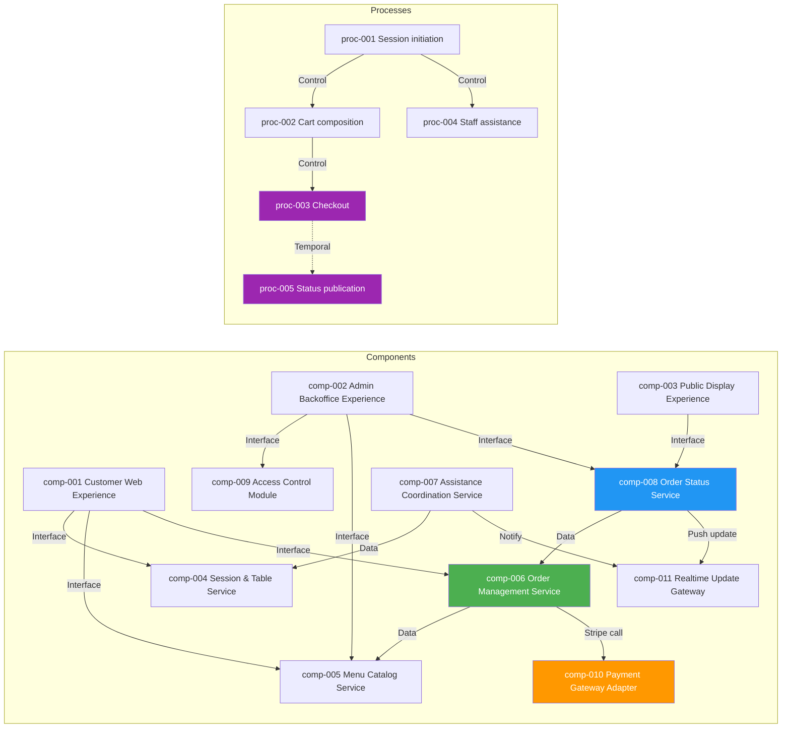

# dependency_map

## dependency_catalog

| dependency_id | source_id | source_type | target_id | target_type | dependency_type | dependency_description | coupling_level | risk_flag |
|---|---|---|---|---|---|---|---|---|
| [dep-001](08_dependencies.md#dep-001) | [comp-001](07_components.md#comp-001) | Component | [comp-004](07_components.md#comp-004) | Component | Interface Dependency | Customer Web Experience calls Session & Table Service to activate QR-based sessions and store the selected mode. | Loose | None |
| [dep-002](08_dependencies.md#dep-002) | [comp-001](07_components.md#comp-001) | Component | [comp-005](07_components.md#comp-005) | Component | Interface Dependency | Customer Web Experience calls Menu Catalog Service to render categories, items, photos, and allergen details. | Loose | None |
| [dep-003](08_dependencies.md#dep-003) | [comp-001](07_components.md#comp-001) | Component | [comp-006](07_components.md#comp-006) | Component | Interface Dependency | Customer Web Experience calls Order Management Service to maintain the cart and submit checkout. | Medium | None |
| [dep-004](08_dependencies.md#dep-004) | [comp-002](07_components.md#comp-002) | Component | [comp-009](07_components.md#comp-009) | Component | Interface Dependency | Admin Backoffice Experience relies on Access Control Module for administrator authentication and session validation. | Medium | None |
| [dep-005](08_dependencies.md#dep-005) | [comp-002](07_components.md#comp-002) | Component | [comp-005](07_components.md#comp-005) | Component | Interface Dependency | Admin Backoffice Experience uses Menu Catalog Service for create, edit, enable/disable, and delete operations. | Medium | Bottleneck |
| [dep-006](08_dependencies.md#dep-006) | [comp-002](07_components.md#comp-002) | Component | [comp-008](07_components.md#comp-008) | Component | Interface Dependency | Admin Backoffice Experience calls Order Status Service to mark orders ready and clear display entries. | Medium | None |
| [dep-007](08_dependencies.md#dep-007) | [comp-003](07_components.md#comp-003) | Component | [comp-008](07_components.md#comp-008) | Component | Interface Dependency | Public Display Experience depends on Order Status Service for the current preparation and pickup-ready projections. | Loose | None |
| [dep-008](08_dependencies.md#dep-008) | [comp-006](07_components.md#comp-006) | Component | [comp-005](07_components.md#comp-005) | Component | Data Dependency | Order Management Service needs authoritative menu item, price, and allergen data from Menu Catalog Service when confirming an order. | Medium | Bottleneck |
| [dep-009](08_dependencies.md#dep-009) | [comp-006](07_components.md#comp-006) | Component | [comp-010](07_components.md#comp-010) | Component | Interface Dependency | Order Management Service delegates card authorisation to Payment Gateway Adapter. | Tight | Single point of failure |
| [dep-010](08_dependencies.md#dep-010) | [comp-007](07_components.md#comp-007) | Component | [comp-004](07_components.md#comp-004) | Component | Data Dependency | Assistance Coordination Service needs session and table context from Session & Table Service before notifying staff. | Medium | None |
| [dep-011](08_dependencies.md#dep-011) | [comp-007](07_components.md#comp-007) | Component | [comp-011](07_components.md#comp-011) | Component | Interface Dependency | Assistance Coordination Service publishes readiness notifications through the Realtime Update Gateway. | Loose | Bottleneck |
| [dep-012](08_dependencies.md#dep-012) | [comp-008](07_components.md#comp-008) | Component | [comp-006](07_components.md#comp-006) | Component | Data Dependency | Order Status Service consumes confirmed-order and lifecycle information from Order Management Service to build display entries. | Tight | Bottleneck |
| [dep-013](08_dependencies.md#dep-013) | [proc-001](06_processes.md#proc-001) | Process | [proc-002](06_processes.md#proc-002) | Process | Control Dependency | Menu browsing and cart composition can start only after a valid session has been created and mode has been selected. | Tight | None |
| [dep-014](08_dependencies.md#dep-014) | [proc-002](06_processes.md#proc-002) | Process | [proc-003](06_processes.md#proc-003) | Process | Control Dependency | Checkout can start only after cart composition has produced at least one selected item. | Tight | None |
| [dep-015](08_dependencies.md#dep-015) | [proc-001](06_processes.md#proc-001) | Process | [proc-004](06_processes.md#proc-004) | Process | Control Dependency | The staff-assisted flow depends on the same initial session creation and mode selection process. | Tight | None |
| [dep-016](08_dependencies.md#dep-016) | [proc-003](06_processes.md#proc-003) | Process | [proc-005](06_processes.md#proc-005) | Process | Temporal Dependency | Public order-status publication follows successful self-service confirmation and order-number assignment. | Medium | None |
| [dep-017](08_dependencies.md#dep-017) | [comp-008](07_components.md#comp-008) | Component | [comp-011](07_components.md#comp-011) | Component | Interface Dependency | Order Status Service uses the Realtime Update Gateway to refresh the public display promptly when readiness changes. | Loose | Bottleneck |
| [dep-018](08_dependencies.md#dep-018) | [comp-009](07_components.md#comp-009) | Component | [ent-022](05_logical_entities.md#ent-022) | Entity | Data Dependency | Access Control Module owns the authenticated admin-session entity used to guard protected actions. | Tight | None |
| [dep-019](08_dependencies.md#dep-019) | [comp-005](07_components.md#comp-005) | Component | [ent-006](05_logical_entities.md#ent-006) | Entity | Data Dependency | Menu Catalog Service is the single owner of the menu-item aggregate used across customer and admin flows. | Tight | None |

## risk_analysis

| risk_id | risk_description | involved_elements | risk_severity | mitigation_suggestion |
|---|---|---|---|---|
| risk-001 | Card checkout depends on one gateway integration path for authorisation outcomes. | [comp-006](07_components.md#comp-006), [comp-010](07_components.md#comp-010), [dep-009](08_dependencies.md#dep-009) | High | Preserve cash as a fallback, make payment requests idempotent, and show retry guidance without creating duplicate orders. |
| risk-002 | Menu Catalog Service serves both customer browsing and admin maintenance, creating a high-fan-out hotspot around menu-item ownership. | [comp-005](07_components.md#comp-005), [dep-002](08_dependencies.md#dep-002), [dep-005](08_dependencies.md#dep-005), [dep-008](08_dependencies.md#dep-008) | Medium | Separate read and write interfaces, cache customer reads aggressively, and snapshot menu data into orders at confirmation time. |
| risk-003 | Order Status Service is tightly coupled to confirmed-order freshness from Order Management Service. | [comp-006](07_components.md#comp-006), [comp-008](07_components.md#comp-008), [dep-012](08_dependencies.md#dep-012), [dep-016](08_dependencies.md#dep-016) | Medium | Build the display projection from committed order events and validate readiness updates with automated integration tests. |
| risk-004 | Realtime Update Gateway concentrates push delivery for both staff notifications and public-display refreshes. | [comp-011](07_components.md#comp-011), [dep-011](08_dependencies.md#dep-011), [dep-017](08_dependencies.md#dep-017) | Medium | Support graceful degradation to short polling for screens that can tolerate a few seconds of delay. |

## traceability_matrix

| requirement_id | entity_ids | process_ids | component_ids | dependency_ids |
|---|---|---|---|---|
| [FR-001](02_functional_requirements.md#fr-001) | [ent-001](05_logical_entities.md#ent-001), [ent-002](05_logical_entities.md#ent-002) | [proc-001](06_processes.md#proc-001) | [comp-001](07_components.md#comp-001), [comp-004](07_components.md#comp-004) | [dep-001](08_dependencies.md#dep-001) |
| [FR-002](02_functional_requirements.md#fr-002) | [ent-002](05_logical_entities.md#ent-002), [ent-003](05_logical_entities.md#ent-003) | [proc-001](06_processes.md#proc-001) | [comp-001](07_components.md#comp-001), [comp-004](07_components.md#comp-004) | [dep-001](08_dependencies.md#dep-001) |
| [FR-003](02_functional_requirements.md#fr-003) | [ent-002](05_logical_entities.md#ent-002), [ent-004](05_logical_entities.md#ent-004) | [proc-001](06_processes.md#proc-001) | [comp-001](07_components.md#comp-001), [comp-004](07_components.md#comp-004) | [dep-001](08_dependencies.md#dep-001) |
| [FR-004](02_functional_requirements.md#fr-004) | [ent-001](05_logical_entities.md#ent-001), [ent-002](05_logical_entities.md#ent-002) | [proc-001](06_processes.md#proc-001) | [comp-004](07_components.md#comp-004) | [dep-001](08_dependencies.md#dep-001) |
| [FR-005](02_functional_requirements.md#fr-005) | [ent-005](05_logical_entities.md#ent-005), [ent-006](05_logical_entities.md#ent-006) | [proc-002](06_processes.md#proc-002) | [comp-001](07_components.md#comp-001), [comp-005](07_components.md#comp-005) | [dep-002](08_dependencies.md#dep-002) |
| [FR-006](02_functional_requirements.md#fr-006) | [ent-006](05_logical_entities.md#ent-006), [ent-007](05_logical_entities.md#ent-007), [ent-008](05_logical_entities.md#ent-008) | [proc-002](06_processes.md#proc-002) | [comp-001](07_components.md#comp-001), [comp-005](07_components.md#comp-005) | [dep-002](08_dependencies.md#dep-002) |
| [FR-007](02_functional_requirements.md#fr-007) | [ent-009](05_logical_entities.md#ent-009), [ent-010](05_logical_entities.md#ent-010) | [proc-002](06_processes.md#proc-002) | [comp-001](07_components.md#comp-001), [comp-006](07_components.md#comp-006) | [dep-003](08_dependencies.md#dep-003) |
| [FR-008](02_functional_requirements.md#fr-008) | [ent-009](05_logical_entities.md#ent-009), [ent-010](05_logical_entities.md#ent-010) | [proc-002](06_processes.md#proc-002) | [comp-001](07_components.md#comp-001), [comp-006](07_components.md#comp-006) | [dep-003](08_dependencies.md#dep-003) |
| [FR-009](02_functional_requirements.md#fr-009) | [ent-009](05_logical_entities.md#ent-009), [ent-010](05_logical_entities.md#ent-010) | [proc-002](06_processes.md#proc-002) | [comp-001](07_components.md#comp-001), [comp-006](07_components.md#comp-006) | [dep-003](08_dependencies.md#dep-003) |
| [FR-010](02_functional_requirements.md#fr-010) | [ent-009](05_logical_entities.md#ent-009), [ent-013](05_logical_entities.md#ent-013) | [proc-003](06_processes.md#proc-003) | [comp-001](07_components.md#comp-001), [comp-006](07_components.md#comp-006) | [dep-003](08_dependencies.md#dep-003), [dep-014](08_dependencies.md#dep-014) |
| [FR-011](02_functional_requirements.md#fr-011) | [ent-011](05_logical_entities.md#ent-011), [ent-012](05_logical_entities.md#ent-012), [ent-013](05_logical_entities.md#ent-013) | [proc-003](06_processes.md#proc-003) | [comp-006](07_components.md#comp-006), [comp-010](07_components.md#comp-010) | [dep-009](08_dependencies.md#dep-009) |
| [FR-012](02_functional_requirements.md#fr-012) | [ent-012](05_logical_entities.md#ent-012), [ent-013](05_logical_entities.md#ent-013), [ent-014](05_logical_entities.md#ent-014), [ent-018](05_logical_entities.md#ent-018) | [proc-003](06_processes.md#proc-003) | [comp-006](07_components.md#comp-006) | [dep-008](08_dependencies.md#dep-008), [dep-016](08_dependencies.md#dep-016) |
| [FR-013](02_functional_requirements.md#fr-013) | [ent-013](05_logical_entities.md#ent-013), [ent-018](05_logical_entities.md#ent-018) | [proc-003](06_processes.md#proc-003) | [comp-001](07_components.md#comp-001), [comp-006](07_components.md#comp-006) | [dep-003](08_dependencies.md#dep-003) |
| [FR-014](02_functional_requirements.md#fr-014) | [ent-009](05_logical_entities.md#ent-009) | [proc-003](06_processes.md#proc-003) | [comp-001](07_components.md#comp-001), [comp-006](07_components.md#comp-006) | [dep-014](08_dependencies.md#dep-014) |
| [FR-015](02_functional_requirements.md#fr-015) | [ent-002](05_logical_entities.md#ent-002), [ent-004](05_logical_entities.md#ent-004), [ent-006](05_logical_entities.md#ent-006) | [proc-004](06_processes.md#proc-004) | [comp-001](07_components.md#comp-001), [comp-004](07_components.md#comp-004), [comp-005](07_components.md#comp-005), [comp-007](07_components.md#comp-007) | [dep-010](08_dependencies.md#dep-010), [dep-015](08_dependencies.md#dep-015) |
| [FR-016](02_functional_requirements.md#fr-016) | [ent-016](05_logical_entities.md#ent-016), [ent-017](05_logical_entities.md#ent-017) | [proc-004](06_processes.md#proc-004) | [comp-001](07_components.md#comp-001), [comp-007](07_components.md#comp-007) | [dep-011](08_dependencies.md#dep-011) |
| [FR-017](02_functional_requirements.md#fr-017) | [ent-016](05_logical_entities.md#ent-016), [ent-017](05_logical_entities.md#ent-017) | [proc-004](06_processes.md#proc-004) | [comp-007](07_components.md#comp-007), [comp-011](07_components.md#comp-011) | [dep-010](08_dependencies.md#dep-010), [dep-011](08_dependencies.md#dep-011) |
| [FR-018](02_functional_requirements.md#fr-018) | [ent-016](05_logical_entities.md#ent-016) | [proc-004](06_processes.md#proc-004) | [comp-007](07_components.md#comp-007) | [dep-015](08_dependencies.md#dep-015) |
| [FR-019](02_functional_requirements.md#fr-019) | [ent-013](05_logical_entities.md#ent-013), [ent-023](05_logical_entities.md#ent-023) | [proc-005](06_processes.md#proc-005) | [comp-003](07_components.md#comp-003), [comp-008](07_components.md#comp-008) | [dep-007](08_dependencies.md#dep-007), [dep-016](08_dependencies.md#dep-016) |
| [FR-020](02_functional_requirements.md#fr-020) | [ent-015](05_logical_entities.md#ent-015), [ent-023](05_logical_entities.md#ent-023) | [proc-005](06_processes.md#proc-005) | [comp-003](07_components.md#comp-003), [comp-008](07_components.md#comp-008) | [dep-007](08_dependencies.md#dep-007), [dep-012](08_dependencies.md#dep-012) |
| [FR-021](02_functional_requirements.md#fr-021) | [ent-015](05_logical_entities.md#ent-015), [ent-019](05_logical_entities.md#ent-019), [ent-023](05_logical_entities.md#ent-023) | [proc-005](06_processes.md#proc-005) | [comp-002](07_components.md#comp-002), [comp-008](07_components.md#comp-008), [comp-011](07_components.md#comp-011) | [dep-006](08_dependencies.md#dep-006), [dep-017](08_dependencies.md#dep-017) |
| [FR-022](02_functional_requirements.md#fr-022) | [ent-015](05_logical_entities.md#ent-015), [ent-023](05_logical_entities.md#ent-023) | [proc-005](06_processes.md#proc-005) | [comp-008](07_components.md#comp-008) | [dep-006](08_dependencies.md#dep-006), [dep-017](08_dependencies.md#dep-017) |
| [FR-023](02_functional_requirements.md#fr-023) | [ent-021](05_logical_entities.md#ent-021), [ent-022](05_logical_entities.md#ent-022) | [proc-007](06_processes.md#proc-007) | [comp-002](07_components.md#comp-002), [comp-009](07_components.md#comp-009) | [dep-004](08_dependencies.md#dep-004), [dep-018](08_dependencies.md#dep-018) |
| [FR-024](02_functional_requirements.md#fr-024) | [ent-006](05_logical_entities.md#ent-006), [ent-007](05_logical_entities.md#ent-007), [ent-008](05_logical_entities.md#ent-008) | [proc-006](06_processes.md#proc-006) | [comp-002](07_components.md#comp-002), [comp-005](07_components.md#comp-005) | [dep-005](08_dependencies.md#dep-005), [dep-019](08_dependencies.md#dep-019) |
| [FR-025](02_functional_requirements.md#fr-025) | [ent-006](05_logical_entities.md#ent-006), [ent-007](05_logical_entities.md#ent-007), [ent-008](05_logical_entities.md#ent-008) | [proc-006](06_processes.md#proc-006) | [comp-002](07_components.md#comp-002), [comp-005](07_components.md#comp-005) | [dep-005](08_dependencies.md#dep-005), [dep-019](08_dependencies.md#dep-019) |
| [FR-026](02_functional_requirements.md#fr-026) | [ent-006](05_logical_entities.md#ent-006) | [proc-006](06_processes.md#proc-006) | [comp-002](07_components.md#comp-002), [comp-005](07_components.md#comp-005) | [dep-005](08_dependencies.md#dep-005), [dep-019](08_dependencies.md#dep-019) |
| [FR-027](02_functional_requirements.md#fr-027) | [ent-006](05_logical_entities.md#ent-006) | [proc-006](06_processes.md#proc-006) | [comp-002](07_components.md#comp-002), [comp-005](07_components.md#comp-005) | [dep-005](08_dependencies.md#dep-005), [dep-019](08_dependencies.md#dep-019) |
| [NFR-001](04c_non_functional_requirements.md#nfr-001) | [ent-012](05_logical_entities.md#ent-012), [ent-013](05_logical_entities.md#ent-013) | [proc-003](06_processes.md#proc-003) | [comp-001](07_components.md#comp-001), [comp-006](07_components.md#comp-006), [comp-010](07_components.md#comp-010) | [dep-003](08_dependencies.md#dep-003), [dep-009](08_dependencies.md#dep-009) |
| [NFR-002](04c_non_functional_requirements.md#nfr-002) | [ent-005](05_logical_entities.md#ent-005), [ent-006](05_logical_entities.md#ent-006), [ent-007](05_logical_entities.md#ent-007) | [proc-002](06_processes.md#proc-002) | [comp-001](07_components.md#comp-001), [comp-005](07_components.md#comp-005) | [dep-002](08_dependencies.md#dep-002) |
| [NFR-003](04c_non_functional_requirements.md#nfr-003) | [ent-013](05_logical_entities.md#ent-013), [ent-023](05_logical_entities.md#ent-023) | [proc-003](06_processes.md#proc-003), [proc-005](06_processes.md#proc-005) | [comp-006](07_components.md#comp-006), [comp-008](07_components.md#comp-008) | [dep-012](08_dependencies.md#dep-012), [dep-016](08_dependencies.md#dep-016) |
| [NFR-004](04c_non_functional_requirements.md#nfr-004) | [ent-013](05_logical_entities.md#ent-013), [ent-014](05_logical_entities.md#ent-014), [ent-018](05_logical_entities.md#ent-018) | [proc-003](06_processes.md#proc-003) | [comp-006](07_components.md#comp-006) | [dep-008](08_dependencies.md#dep-008) |
| [NFR-005](04c_non_functional_requirements.md#nfr-005) | [ent-011](05_logical_entities.md#ent-011), [ent-012](05_logical_entities.md#ent-012), [ent-020](05_logical_entities.md#ent-020) | [proc-003](06_processes.md#proc-003) | [comp-006](07_components.md#comp-006), [comp-010](07_components.md#comp-010) | [dep-009](08_dependencies.md#dep-009) |
| [NFR-006](04c_non_functional_requirements.md#nfr-006) | [ent-021](05_logical_entities.md#ent-021), [ent-022](05_logical_entities.md#ent-022) | [proc-007](06_processes.md#proc-007) | [comp-002](07_components.md#comp-002), [comp-009](07_components.md#comp-009) | [dep-004](08_dependencies.md#dep-004), [dep-018](08_dependencies.md#dep-018) |
| [NFR-007](04c_non_functional_requirements.md#nfr-007) | [ent-002](05_logical_entities.md#ent-002), [ent-003](05_logical_entities.md#ent-003), [ent-013](05_logical_entities.md#ent-013) | [proc-001](06_processes.md#proc-001), [proc-003](06_processes.md#proc-003) | [comp-004](07_components.md#comp-004), [comp-006](07_components.md#comp-006) | [dep-001](08_dependencies.md#dep-001), [dep-016](08_dependencies.md#dep-016) |
| [NFR-008](04c_non_functional_requirements.md#nfr-008) | [ent-002](05_logical_entities.md#ent-002), [ent-009](05_logical_entities.md#ent-009), [ent-013](05_logical_entities.md#ent-013) | [proc-001](06_processes.md#proc-001), [proc-002](06_processes.md#proc-002), [proc-003](06_processes.md#proc-003) | [comp-001](07_components.md#comp-001), [comp-004](07_components.md#comp-004), [comp-005](07_components.md#comp-005), [comp-006](07_components.md#comp-006) | [dep-001](08_dependencies.md#dep-001), [dep-002](08_dependencies.md#dep-002), [dep-003](08_dependencies.md#dep-003) |
| [NFR-009](04c_non_functional_requirements.md#nfr-009) | [ent-006](05_logical_entities.md#ent-006), [ent-007](05_logical_entities.md#ent-007), [ent-008](05_logical_entities.md#ent-008) | [proc-002](06_processes.md#proc-002) | [comp-001](07_components.md#comp-001), [comp-005](07_components.md#comp-005) | [dep-002](08_dependencies.md#dep-002) |
| [NFR-010](04c_non_functional_requirements.md#nfr-010) | [ent-002](05_logical_entities.md#ent-002), [ent-013](05_logical_entities.md#ent-013), [ent-023](05_logical_entities.md#ent-023) | [proc-001](06_processes.md#proc-001), [proc-003](06_processes.md#proc-003), [proc-005](06_processes.md#proc-005) | [comp-004](07_components.md#comp-004), [comp-006](07_components.md#comp-006), [comp-008](07_components.md#comp-008) | [dep-012](08_dependencies.md#dep-012), [dep-016](08_dependencies.md#dep-016) |
| [NFR-011](04c_non_functional_requirements.md#nfr-011) | [ent-012](05_logical_entities.md#ent-012), [ent-022](05_logical_entities.md#ent-022) | [proc-003](06_processes.md#proc-003), [proc-007](06_processes.md#proc-007) | [comp-006](07_components.md#comp-006), [comp-009](07_components.md#comp-009), [comp-010](07_components.md#comp-010) | [dep-009](08_dependencies.md#dep-009), [dep-018](08_dependencies.md#dep-018) |
| [NFR-012](04c_non_functional_requirements.md#nfr-012) | [ent-013](05_logical_entities.md#ent-013), [ent-023](05_logical_entities.md#ent-023) | [proc-005](06_processes.md#proc-005), [proc-006](06_processes.md#proc-006), [proc-007](06_processes.md#proc-007) | [comp-002](07_components.md#comp-002), [comp-005](07_components.md#comp-005), [comp-008](07_components.md#comp-008), [comp-009](07_components.md#comp-009) | [dep-005](08_dependencies.md#dep-005), [dep-006](08_dependencies.md#dep-006), [dep-012](08_dependencies.md#dep-012) |

## dependency_graph

## dependency_anchors

### dep-001

- **Source:** [comp-001](07_components.md#comp-001)
- **Target:** [comp-004](07_components.md#comp-004)
- **Type:** Interface Dependency
- **Summary:** Customer Web Experience calls Session & Table Service to activate QR-based sessions and store the selected mode.

### dep-002

- **Source:** [comp-001](07_components.md#comp-001)
- **Target:** [comp-005](07_components.md#comp-005)
- **Type:** Interface Dependency
- **Summary:** Customer Web Experience calls Menu Catalog Service to render categories, items, photos, and allergen details.

### dep-003

- **Source:** [comp-001](07_components.md#comp-001)
- **Target:** [comp-006](07_components.md#comp-006)
- **Type:** Interface Dependency
- **Summary:** Customer Web Experience calls Order Management Service to maintain the cart and submit checkout.

### dep-004

- **Source:** [comp-002](07_components.md#comp-002)
- **Target:** [comp-009](07_components.md#comp-009)
- **Type:** Interface Dependency
- **Summary:** Admin Backoffice Experience relies on Access Control Module for administrator authentication and session validation.

### dep-005

- **Source:** [comp-002](07_components.md#comp-002)
- **Target:** [comp-005](07_components.md#comp-005)
- **Type:** Interface Dependency
- **Summary:** Admin Backoffice Experience uses Menu Catalog Service for create, edit, enable/disable, and delete operations.

### dep-006

- **Source:** [comp-002](07_components.md#comp-002)
- **Target:** [comp-008](07_components.md#comp-008)
- **Type:** Interface Dependency
- **Summary:** Admin Backoffice Experience calls Order Status Service to mark orders ready and clear display entries.

### dep-007

- **Source:** [comp-003](07_components.md#comp-003)
- **Target:** [comp-008](07_components.md#comp-008)
- **Type:** Interface Dependency
- **Summary:** Public Display Experience depends on Order Status Service for the current preparation and pickup-ready projections.

### dep-008

- **Source:** [comp-006](07_components.md#comp-006)
- **Target:** [comp-005](07_components.md#comp-005)
- **Type:** Data Dependency
- **Summary:** Order Management Service needs authoritative menu item, price, and allergen data from Menu Catalog Service when confirming an order.

### dep-009

- **Source:** [comp-006](07_components.md#comp-006)
- **Target:** [comp-010](07_components.md#comp-010)
- **Type:** Interface Dependency
- **Summary:** Order Management Service delegates card authorisation to Payment Gateway Adapter.

### dep-010

- **Source:** [comp-007](07_components.md#comp-007)
- **Target:** [comp-004](07_components.md#comp-004)
- **Type:** Data Dependency
- **Summary:** Assistance Coordination Service needs session and table context from Session & Table Service before notifying staff.

### dep-011

- **Source:** [comp-007](07_components.md#comp-007)
- **Target:** [comp-011](07_components.md#comp-011)
- **Type:** Interface Dependency
- **Summary:** Assistance Coordination Service publishes readiness notifications through the Realtime Update Gateway.

### dep-012

- **Source:** [comp-008](07_components.md#comp-008)
- **Target:** [comp-006](07_components.md#comp-006)
- **Type:** Data Dependency
- **Summary:** Order Status Service consumes confirmed-order and lifecycle information from Order Management Service to build display entries.

### dep-013

- **Source:** [proc-001](06_processes.md#proc-001)
- **Target:** [proc-002](06_processes.md#proc-002)
- **Type:** Control Dependency
- **Summary:** Menu browsing and cart composition can start only after a valid session has been created and mode has been selected.

### dep-014

- **Source:** [proc-002](06_processes.md#proc-002)
- **Target:** [proc-003](06_processes.md#proc-003)
- **Type:** Control Dependency
- **Summary:** Checkout can start only after cart composition has produced at least one selected item.

### dep-015

- **Source:** [proc-001](06_processes.md#proc-001)
- **Target:** [proc-004](06_processes.md#proc-004)
- **Type:** Control Dependency
- **Summary:** The staff-assisted flow depends on the same initial session creation and mode selection process.

### dep-016

- **Source:** [proc-003](06_processes.md#proc-003)
- **Target:** [proc-005](06_processes.md#proc-005)
- **Type:** Temporal Dependency
- **Summary:** Public order-status publication follows successful self-service confirmation and order-number assignment.

### dep-017

- **Source:** [comp-008](07_components.md#comp-008)
- **Target:** [comp-011](07_components.md#comp-011)
- **Type:** Interface Dependency
- **Summary:** Order Status Service uses the Realtime Update Gateway to refresh the public display promptly when readiness changes.

### dep-018

- **Source:** [comp-009](07_components.md#comp-009)
- **Target:** [ent-022](05_logical_entities.md#ent-022)
- **Type:** Data Dependency
- **Summary:** Access Control Module owns the authenticated admin-session entity used to guard protected actions.

### dep-019

- **Source:** [comp-005](07_components.md#comp-005)
- **Target:** [ent-006](05_logical_entities.md#ent-006)
- **Type:** Data Dependency
- **Summary:** Menu Catalog Service is the single owner of the menu-item aggregate used across customer and admin flows.

DEPENDENCIES_COMPLETED
