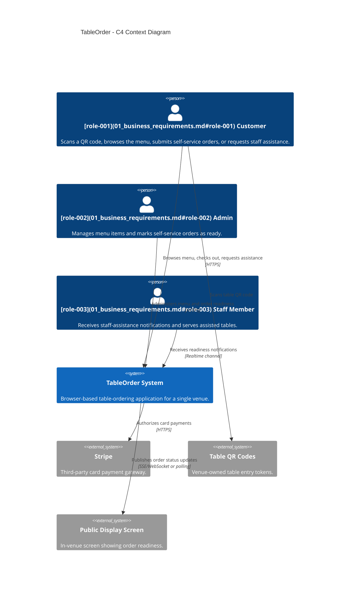
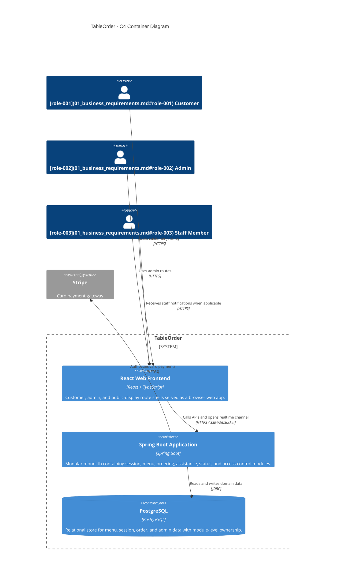
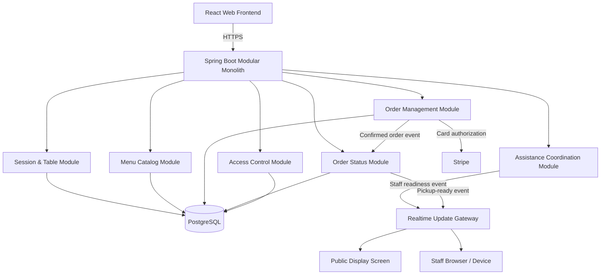

# architecture_design

## architecture_summary

| attribute | value |
|---|---|
| primary_style | Modular Monolith |
| architecture_quanta | 3 |
| total_services | 5 |
| total_adrs | 7 |
| tech_stack_specs_used | User-confirmed stack: Spring Boot; React + TypeScript; PostgreSQL; Stripe |
| communication_pattern | hybrid |
| data_strategy | shared PostgreSQL with module ownership |

## architecture_characteristics

| Characteristic | Score | Evidence from artifacts |
|---|---|---|
| Scalability | 2 | [NFR-010](04c_non_functional_requirements.md#nfr-010) caps peak load at about 40–50 simultaneous users in a single venue, so moderate vertical scaling is sufficient. |
| Elasticity | 1 | The venue is single-site, service-hour bounded, and has no multi-tenant bursts or global demand swings in the artifacts. |
| Fault Tolerance | 2 | [NFR-003](04c_non_functional_requirements.md#nfr-003) and [NFR-004](04c_non_functional_requirements.md#nfr-004) require service continuity during opening hours and no loss of confirmed orders after confirmation. |
| Deployability | 2 | [NFR-012](04c_non_functional_requirements.md#nfr-012) requires updates with minimal interruption, but the modest deployment footprint does not justify operationally heavy decomposition. |
| Testability | 3 | Checkout correctness, payment failure handling, and readiness updates across [proc-003](06_processes.md#proc-003) and [proc-005](06_processes.md#proc-005) require strong automated testing boundaries. |
| Modularity | 3 | The design splits into clear bounded contexts and logical services across entities, processes, and components. |
| Performance | 3 | [NFR-001](04c_non_functional_requirements.md#nfr-001) and [NFR-002](04c_non_functional_requirements.md#nfr-002) require customer-visible interactions to complete within three seconds. |
| Simplicity | 3 | Single venue, one payment provider, no external IdP, and no staff kitchen console in v1 favour a simple runtime model. |
| Evolvability | 2 | The artifacts suggest future extension points such as staff tooling and richer readiness flows, but not immediate independent-team scaling. |
| Cost | 3 | Single-site economics and user volume make low operational overhead a first-order concern. |

## style_fitness_evaluation

| Style | Scalability | Elasticity | Fault Tolerance | Deployability | Testability | Modularity | Total Fit |
|---|---|---|---|---|---|---|---|
| Layered Monolith | ★★ | ★ | ★★ | ★★ | ★★★ | ★★ | 14/21 |
| Modular Monolith | ★★★ | ★ | ★★ | ★★★ | ★★★ | ★★★ | 18/21 |
| Service-Based | ★★ | ★★ | ★★ | ★★ | ★★ | ★★★ | 15/21 |
| Microservices | ★★★ | ★★★ | ★★★ | ★★ | ★★ | ★★★ | 16/21 |
| Event-Driven | ★★ | ★★ | ★★★ | ★★ | ★★ | ★★ | 15/21 |

## architecture_decision_records

### adr_index

- [ADR-001](09_architecture_design.md#adr-001) — Primary Architectural Style
- [ADR-002](09_architecture_design.md#adr-002) — Communication Patterns
- [ADR-003](09_architecture_design.md#adr-003) — Data Architecture Strategy
- [ADR-004](09_architecture_design.md#adr-004) — Integration Patterns
- [ADR-005](09_architecture_design.md#adr-005) — Frontend Architecture
- [ADR-006](09_architecture_design.md#adr-006) — Authentication and Authorization Strategy
- [ADR-007](09_architecture_design.md#adr-007) — Resilience and Observability Approach

### ADR-001

**Title:** Primary Architectural Style

**Status:** Proposed
**Date:** 2026-06-26

**Context:**
The artifact set shows 6 bounded contexts, 5 logical service components, and a single-venue load profile of only about 40–50 concurrent users. [NFR-001](04c_non_functional_requirements.md#nfr-001), [NFR-002](04c_non_functional_requirements.md#nfr-002), [NFR-010](04c_non_functional_requirements.md#nfr-010), and [NFR-012](04c_non_functional_requirements.md#nfr-012) require fast customer interactions and low-disruption deployment, while the user confirmed Spring Boot, React + TypeScript, PostgreSQL, and Stripe as the fixed stack. DocMind searches returned project artifacts but no dedicated architecture-style reference document, so the style choice relies on the extracted design evidence and built-in architecture knowledge. Relevant elements: [comp-004](07_components.md#comp-004), [comp-005](07_components.md#comp-005), [comp-006](07_components.md#comp-006), [comp-007](07_components.md#comp-007), [comp-008](07_components.md#comp-008), [dep-008](08_dependencies.md#dep-008), [dep-012](08_dependencies.md#dep-012), [proc-003](06_processes.md#proc-003), [proc-005](06_processes.md#proc-005).

**Decision:**
Adopt a Modular Monolith with explicit internal modules aligned to the bounded contexts and expose it through a small set of web-facing APIs. This keeps runtime and operations simple for a single venue while preserving modular boundaries for future extraction if load or organisational complexity increases.

**Alternatives Considered:**

| Alternative | Pros | Cons | Fitness Score |
|---|---|---|---|
| Modular Monolith | Low operational cost, natural fit for one venue, strong transactional consistency for checkout and order status. | Requires discipline to preserve module boundaries inside one deployable unit. | 9/10 |
| Service-Based | Improves future extraction flexibility. | Adds network, deployment, and observability overhead too early for the scale described in [NFR-010](04c_non_functional_requirements.md#nfr-010). | 7/10 |
| Microservices | Maximum independent scaling and deployment freedom. | Over-engineered for one venue, higher cost, and unnecessary distributed-complexity risks. | 5/10 |

**Consequences:**
- Positive: simpler deployment, easier data consistency, lower cost, and faster delivery for v1.
- Negative: backend modules share one deployable unit and therefore one release cadence.
- Risks: module boundaries may erode unless enforced through package structure, tests, and ownership rules.

**References:**
- Project artifacts only; no dedicated architecture-style reference doc was found in DocMind for tableorder.
- [comp-004](07_components.md#comp-004), [comp-005](07_components.md#comp-005), [comp-006](07_components.md#comp-006), [comp-007](07_components.md#comp-007), [comp-008](07_components.md#comp-008)
- [dep-008](08_dependencies.md#dep-008), [dep-012](08_dependencies.md#dep-012), [proc-003](06_processes.md#proc-003), [proc-005](06_processes.md#proc-005)

### ADR-002

**Title:** Communication Patterns

**Status:** Proposed
**Date:** 2026-06-26

**Context:**
[proc-001](06_processes.md#proc-001) through [proc-004](06_processes.md#proc-004) are request/response-oriented customer journeys that must satisfy 3-second UX targets. [proc-005](06_processes.md#proc-005) additionally needs immediate public-display refresh when an order becomes ready, and [proc-004](06_processes.md#proc-004) needs staff notification delivery without creating an order. Relevant elements: [proc-003](06_processes.md#proc-003), [proc-004](06_processes.md#proc-004), [proc-005](06_processes.md#proc-005), [comp-008](07_components.md#comp-008), [comp-011](07_components.md#comp-011), [dep-011](08_dependencies.md#dep-011), [dep-017](08_dependencies.md#dep-017).

**Decision:**
Use synchronous HTTP APIs for customer and admin commands plus lightweight asynchronous internal domain events for readiness and display updates. Deliver browser updates through SSE or WebSocket channels behind [comp-011](07_components.md#comp-011), while keeping most business logic in synchronous application services.

**Alternatives Considered:**

| Alternative | Pros | Cons | Fitness Score |
|---|---|---|---|
| Hybrid sync + async | Fast UX for commands plus timely push updates for readiness and display screens. | Requires two interaction styles in the codebase. | 9/10 |
| Pure synchronous REST | Simpler programming model. | Would force polling for status refresh and delay staff/display updates. | 6/10 |
| Message-first event-driven | Strong decoupling for projections and notifications. | Adds unnecessary platform complexity for a single-site app. | 6/10 |

**Consequences:**
- Positive: checkout remains simple while display and notification use cases get timely updates.
- Negative: realtime transport must be monitored and have a fallback path.
- Risks: [comp-011](07_components.md#comp-011) can become a bottleneck if transport health is ignored.

**References:**
- Project artifacts only; no separate communication-pattern reference doc was found in DocMind.
- [proc-003](06_processes.md#proc-003), [proc-004](06_processes.md#proc-004), [proc-005](06_processes.md#proc-005)
- [comp-011](07_components.md#comp-011), [dep-011](08_dependencies.md#dep-011), [dep-017](08_dependencies.md#dep-017)

### ADR-003

**Title:** Data Architecture Strategy

**Status:** Proposed
**Date:** 2026-06-26

**Context:**
The chosen style is a modular monolith, confirmed orders must never be lost after confirmation (NFR-004), and the app serves one venue with modest concurrency. Entities form clear ownership clusters around sessions, catalog, ordering, assistance, status, and access control, but cross-module flows such as [dep-008](08_dependencies.md#dep-008) and [dep-012](08_dependencies.md#dep-012) are still strongly related. Relevant elements: [ent-002](05_logical_entities.md#ent-002), [ent-006](05_logical_entities.md#ent-006), [ent-013](05_logical_entities.md#ent-013), [ent-016](05_logical_entities.md#ent-016), [ent-021](05_logical_entities.md#ent-021), [dep-008](08_dependencies.md#dep-008), [dep-012](08_dependencies.md#dep-012).

**Decision:**
Use one PostgreSQL database with schema ownership by module and strict application-level ownership rules. Keep transactional writes for checkout inside the ordering core, expose other data through module interfaces, and store order-line/menu snapshots to reduce future coupling.

**Alternatives Considered:**

| Alternative | Pros | Cons | Fitness Score |
|---|---|---|---|
| Shared PostgreSQL with module ownership | Best fit for transactional integrity, lowest ops cost, simplest backups. | Requires discipline to avoid accidental cross-module table access. | 9/10 |
| Database per service | Strong technical isolation. | Not justified until modules become independently deployable services. | 5/10 |
| Hybrid shared + replicated stores | Can optimise reads later. | Adds projection and consistency complexity before there is evidence of need. | 6/10 |

**Consequences:**
- Positive: durable order confirmation and simple reporting/operations.
- Negative: database schema governance becomes critical to preserve logical boundaries.
- Risks: ungoverned direct SQL access could bypass module APIs and increase connascence.

**References:**
- Project artifacts only; no dedicated data-architecture reference doc was found in DocMind.
- [ent-002](05_logical_entities.md#ent-002), [ent-006](05_logical_entities.md#ent-006), [ent-013](05_logical_entities.md#ent-013), [ent-016](05_logical_entities.md#ent-016), [ent-021](05_logical_entities.md#ent-021)
- [dep-008](08_dependencies.md#dep-008), [dep-012](08_dependencies.md#dep-012)

### ADR-004

**Title:** Integration Patterns

**Status:** Proposed
**Date:** 2026-06-26

**Context:**
The only mandatory external integration is Stripe for card payments, while QR codes are venue-owned entry tokens and order readiness must appear on a public screen without a separate mobile push requirement. Relevant elements: [comp-010](07_components.md#comp-010), [comp-011](07_components.md#comp-011), [dep-009](08_dependencies.md#dep-009), [dep-017](08_dependencies.md#dep-017), [proc-001](06_processes.md#proc-001), [proc-003](06_processes.md#proc-003), [proc-005](06_processes.md#proc-005), [NFR-005](04c_non_functional_requirements.md#nfr-005).

**Decision:**
Implement a gateway-adapter pattern for Stripe, server-validated deep links for table QR codes, and a push-projection pattern for the public display and staff notifications. Keep integration seams explicit so that payment, QR resolution rules, and realtime transports can evolve independently of the domain core.

**Alternatives Considered:**

| Alternative | Pros | Cons | Fitness Score |
|---|---|---|---|
| Gateway adapters + push projections | Encapsulates external concerns and keeps the domain model clean. | Adds a thin abstraction layer to maintain. | 9/10 |
| Direct Stripe SDK calls from order logic | Less code initially. | Leaks payment concerns into the ordering core and weakens testing boundaries. | 5/10 |
| External message broker first | Scales future integrations. | Operationally unnecessary for v1 and contradicts simplicity goals. | 6/10 |

**Consequences:**
- Positive: cleaner test seams, better PCI scope control, and simpler future replacement of transport details.
- Negative: adapters must be versioned and kept aligned with provider changes.
- Risks: if the adapter contract is too thin, integration-specific failure semantics may leak upward anyway.

**References:**
- Project artifacts only; no dedicated integration-pattern reference doc was found in DocMind.
- [comp-010](07_components.md#comp-010), [comp-011](07_components.md#comp-011)
- [dep-009](08_dependencies.md#dep-009), [dep-017](08_dependencies.md#dep-017), [proc-001](06_processes.md#proc-001), [proc-003](06_processes.md#proc-003), [proc-005](06_processes.md#proc-005)

### ADR-005

**Title:** Frontend Architecture

**Status:** Proposed
**Date:** 2026-06-26

**Context:**
The customer app is browser-based, mobile-first, and requires no installation; the same overall solution also needs protected admin screens and an unauthenticated public display. The artifacts emphasise first-time usability, prominent allergen visibility, and a small number of steps. Relevant elements: [comp-001](07_components.md#comp-001), [comp-002](07_components.md#comp-002), [comp-003](07_components.md#comp-003), [proc-001](06_processes.md#proc-001), [proc-002](06_processes.md#proc-002), [proc-005](06_processes.md#proc-005), [NFR-008](04c_non_functional_requirements.md#nfr-008), [NFR-009](04c_non_functional_requirements.md#nfr-009).

**Decision:**
Use a React + TypeScript route-based web frontend with three shells in one codebase: customer flow, admin backoffice, and public display. Share design-system primitives and API clients, but isolate route guards and state slices per shell to prevent accidental coupling between anonymous and protected experiences.

**Alternatives Considered:**

| Alternative | Pros | Cons | Fitness Score |
|---|---|---|---|
| Single React codebase with route shells | Lowest delivery cost, consistent UX, easy reuse of validation and display components. | Requires careful routing and access-separation rules. | 9/10 |
| Separate frontend projects per audience | Clearer repository-level separation. | Higher maintenance overhead for a very small v1 scope. | 6/10 |
| Server-rendered UI only | Simple hosting. | Less flexible for dynamic cart and realtime display updates. | 6/10 |

**Consequences:**
- Positive: consistent UI primitives, simplified deployment, and fast development for v1.
- Negative: frontend release cadence is shared across customer, admin, and display surfaces.
- Risks: careless shared state could blur anonymous-session and admin-session concerns.

**References:**
- Project artifacts only; no dedicated frontend-architecture reference doc was found in DocMind.
- [comp-001](07_components.md#comp-001), [comp-002](07_components.md#comp-002), [comp-003](07_components.md#comp-003)
- [proc-001](06_processes.md#proc-001), [proc-002](06_processes.md#proc-002), [proc-005](06_processes.md#proc-005)

### ADR-006

**Title:** Authentication and Authorization Strategy

**Status:** Proposed
**Date:** 2026-06-26

**Context:**
The user confirmed username/password admin authentication with no external IdP, while customers remain anonymous and session-scoped from QR scan through order completion. GDPR minimisation also forbids keeping personal data longer than necessary. Relevant elements: [comp-004](07_components.md#comp-004), [comp-009](07_components.md#comp-009), [ent-002](05_logical_entities.md#ent-002), [ent-021](05_logical_entities.md#ent-021), [ent-022](05_logical_entities.md#ent-022), [proc-001](06_processes.md#proc-001), [proc-007](06_processes.md#proc-007), [NFR-006](04c_non_functional_requirements.md#nfr-006), [NFR-007](04c_non_functional_requirements.md#nfr-007).

**Decision:**
Use Spring Security for admin username/password authentication with password hashing, role-based authorisation, CSRF protection, and short-lived HTTP-only secure session cookies. Model customers as anonymous sessions identified by opaque server-issued tokens tied to the QR-started ordering session, and purge customer names when the order lifecycle completes.

**Alternatives Considered:**

| Alternative | Pros | Cons | Fitness Score |
|---|---|---|---|
| Local admin auth + anonymous customer sessions | Matches stated constraints, minimises dependencies, and keeps customer onboarding frictionless. | Requires careful session-expiry and cookie-hardening configuration. | 9/10 |
| JWT for both admin and customer flows | Stateless and API-friendly. | Adds token-lifecycle complexity without a strong scaling need for v1. | 7/10 |
| External IdP | Strong identity features. | Explicitly out of scope for this phase and adds vendor/runtime dependency. | 4/10 |

**Consequences:**
- Positive: simple ops, clear separation between admin and customer identity models, and direct compliance with stated access constraints.
- Negative: admin-session storage and expiry logic must be maintained server-side.
- Risks: insufficient cookie or timeout hardening would weaken the venue-device threat model.

**References:**
- Project artifacts only; no dedicated auth-strategy reference doc was found in DocMind.
- [ent-002](05_logical_entities.md#ent-002), [ent-021](05_logical_entities.md#ent-021), [ent-022](05_logical_entities.md#ent-022)
- [comp-004](07_components.md#comp-004), [comp-009](07_components.md#comp-009), [proc-001](06_processes.md#proc-001), [proc-007](06_processes.md#proc-007)

### ADR-007

**Title:** Resilience and Observability Approach

**Status:** Proposed
**Date:** 2026-06-26

**Context:**
[NFR-003](04c_non_functional_requirements.md#nfr-003), [NFR-004](04c_non_functional_requirements.md#nfr-004), [NFR-011](04c_non_functional_requirements.md#nfr-011), and [NFR-012](04c_non_functional_requirements.md#nfr-012) require operational continuity, order durability, diagnosability, and low-disruption updates. The design also highlights two concentrated risk areas: payment and realtime status delivery. Relevant elements: [comp-006](07_components.md#comp-006), [comp-008](07_components.md#comp-008), [comp-010](07_components.md#comp-010), [comp-011](07_components.md#comp-011), [dep-009](08_dependencies.md#dep-009), [dep-017](08_dependencies.md#dep-017), risk-001, risk-004.

**Decision:**
Instrument the Spring Boot application with structured logs, request correlation IDs, health endpoints, metrics, and alertable error traces. Apply retries with idempotency for Stripe-facing calls where safe, keep order-confirmation writes transactional, and allow SSE/WebSocket consumers to fall back to polling if the realtime channel is degraded.

**Alternatives Considered:**

| Alternative | Pros | Cons | Fitness Score |
|---|---|---|---|
| Structured observability + targeted resilience patterns | Addresses the identified risks with minimal platform overhead. | Still requires disciplined operational dashboards and alerts. | 9/10 |
| Minimal logging only | Cheaper initially. | Fails [NFR-011](04c_non_functional_requirements.md#nfr-011) and makes payment/display incidents hard to diagnose quickly. | 3/10 |
| Full service-mesh resilience stack | Powerful controls. | Far too heavy for a single modular-monolith deployment. | 4/10 |

**Consequences:**
- Positive: faster incident diagnosis, safer payment retries, and graceful degradation for venue screens.
- Negative: extra implementation work for correlation and monitoring plumbing.
- Risks: if alerting thresholds are not tuned, noise may hide real incidents during service hours.

**References:**
- Project artifacts only; no dedicated observability reference doc was found in DocMind.
- [comp-006](07_components.md#comp-006), [comp-008](07_components.md#comp-008), [comp-010](07_components.md#comp-010), [comp-011](07_components.md#comp-011)
- [dep-009](08_dependencies.md#dep-009), [dep-017](08_dependencies.md#dep-017), risk-001, risk-004

## c4_context_diagram

## c4_container_diagram

## component_service_mapping

| component_id | component_name | service_name | deployment_unit | communication |
|---|---|---|---|---|
| [comp-001](07_components.md#comp-001) | Customer Web Experience | React Web Frontend | Static web app bundle | HTTPS + SSE/WebSocket |
| [comp-002](07_components.md#comp-002) | Admin Backoffice Experience | React Web Frontend | Static web app bundle | HTTPS + SSE/WebSocket |
| [comp-003](07_components.md#comp-003) | Public Display Experience | React Web Frontend | Static web app bundle | HTTPS + SSE/WebSocket |
| [comp-004](07_components.md#comp-004) | Session & Table Service | Spring Boot Application | Backend application container | Internal module call / REST endpoint |
| [comp-005](07_components.md#comp-005) | Menu Catalog Service | Spring Boot Application | Backend application container | Internal module call / REST endpoint |
| [comp-006](07_components.md#comp-006) | Order Management Service | Spring Boot Application | Backend application container | Internal module call / REST endpoint |
| [comp-007](07_components.md#comp-007) | Assistance Coordination Service | Spring Boot Application | Backend application container | Internal module call / REST endpoint |
| [comp-008](07_components.md#comp-008) | Order Status Service | Spring Boot Application | Backend application container | Internal module call / REST endpoint |
| [comp-009](07_components.md#comp-009) | Access Control Module | Spring Boot Application | Backend application container | Internal module call |
| [comp-010](07_components.md#comp-010) | Payment Gateway Adapter | Spring Boot Application | Backend application container | HTTPS to Stripe |
| [comp-011](07_components.md#comp-011) | Realtime Update Gateway | Spring Boot Application | Backend application container | SSE/WebSocket transport |

## integration_architecture

## cross_cutting_concerns

| Concern | Pattern | Technology (from stack spec) | ADR Reference |
|---|---|---|---|
| Authentication | Local admin authentication with role-based authorization and anonymous customer sessions | Spring Security, secure cookies | [ADR-006](09_architecture_design.md#adr-006) |
| Observability | Structured logging, metrics, tracing, health checks | Spring Boot Actuator, log correlation | [ADR-007](09_architecture_design.md#adr-007) |
| Resilience | Transactional order confirmation, safe retries, polling fallback for realtime consumers | Spring Retry patterns, SSE/WebSocket fallback | [ADR-007](09_architecture_design.md#adr-007) |
| Configuration | Environment-based configuration with per-venue secrets and timeout settings | Spring profiles, externalized config | [ADR-001](09_architecture_design.md#adr-001) |
| Data protection | Short-lived customer-name retention and payment-data isolation | PostgreSQL retention jobs, Stripe-hosted payment handling | [ADR-003](09_architecture_design.md#adr-003), [ADR-006](09_architecture_design.md#adr-006) |
| Frontend consistency | Shared design system and route-shell segregation | React + TypeScript component library | [ADR-005](09_architecture_design.md#adr-005) |

## architecture_quantum_analysis

| quantum_id | quantum_name | services | coupling_point | characteristics |
|---|---|---|---|---|
| q-001 | Web experience quantum | Customer Web Experience, Admin Backoffice Experience, Public Display Experience | Shared frontend release train and API contract | High simplicity, high usability, moderate deployability |
| q-002 | Ordering core quantum | Session & Table Service, Menu Catalog Service, Order Management Service, Access Control Module | Shared PostgreSQL transactions and in-process module calls | High consistency, high testability, low ops cost |
| q-003 | Realtime and integration quantum | Assistance Coordination Service, Order Status Service, Payment Gateway Adapter, Realtime Update Gateway | External provider contracts and push-delivery semantics | Moderate fault tolerance, moderate coupling, explicit integration seams |

ARCHITECTURE_DESIGN_COMPLETED: 7 ADRs produced, 3 quanta identified, primary style: Modular Monolith
